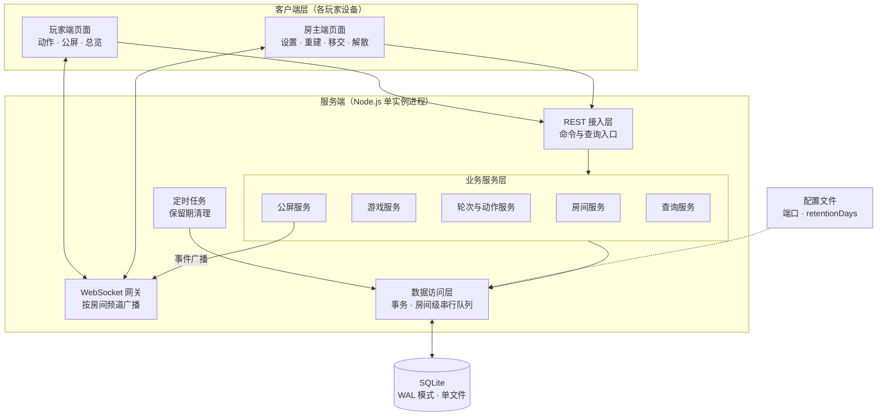
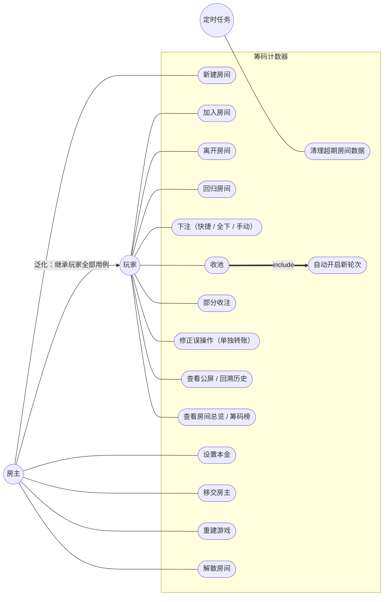
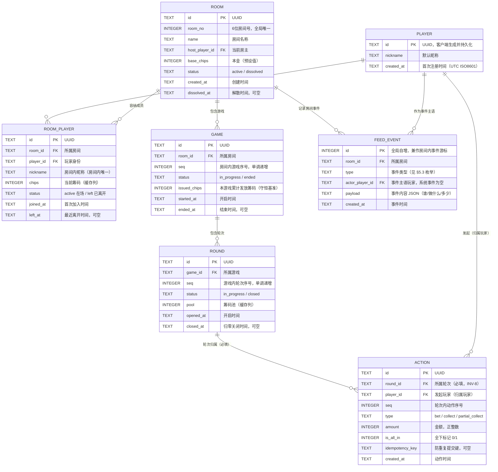
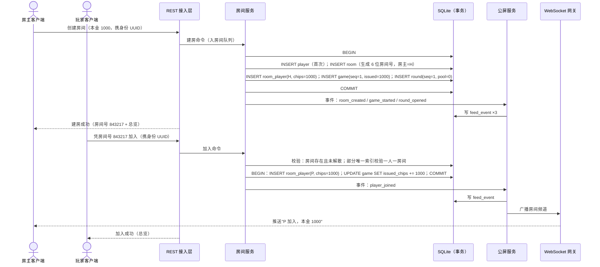
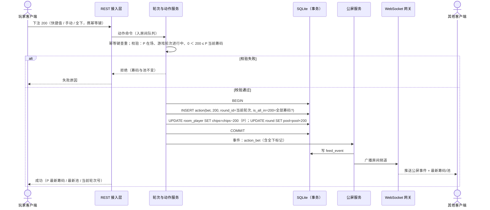
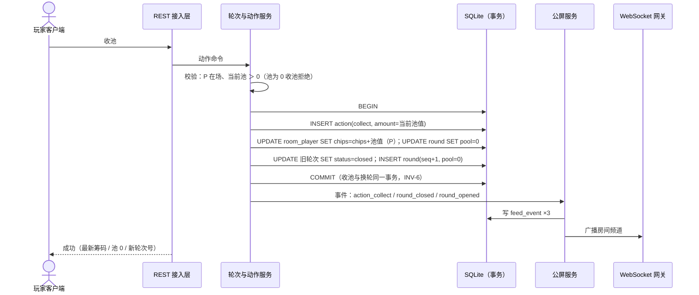
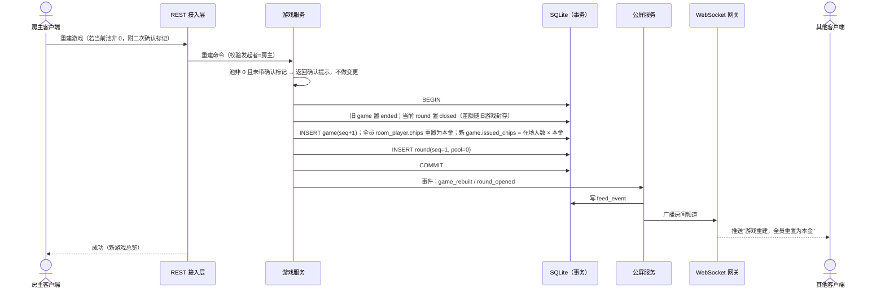
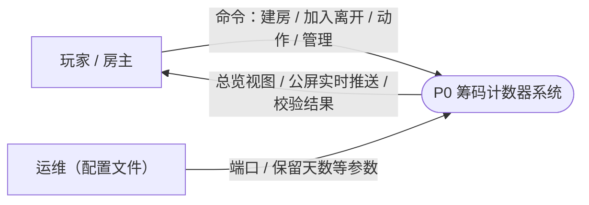
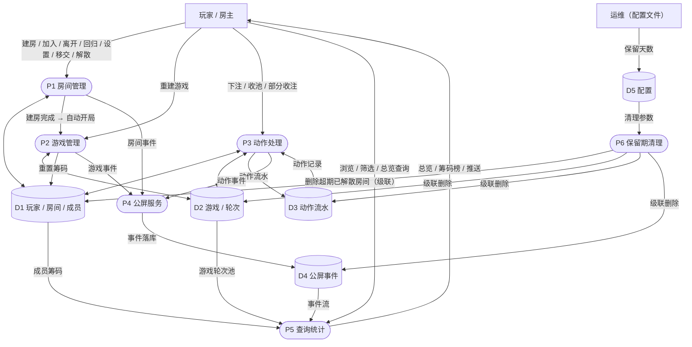

# 筹码计数器 概要设计文档

| 项目 | 内容 |
| --- | --- |
| 文档版本 | v1.0 |
| 发布日期 | 2026-09-17 |
| 文档状态 | 初稿 |
| 设计依据 | [doc/requirements.md](./requirements.md) v2.9（需求规格书） |
| 范围声明 | 本文档为概要设计：给出系统架构、用例模型、数据设计（ER 与数据库表）、关键流程时序与数据流。**接口设计（REST 路径、报文结构、推送协议细节）不在本文档范围**，另行输出接口设计文档 |

---

## 1. 引言

### 1.1 目的

依据《筹码计数器需求规格书》v2.9，给出系统的总体设计与数据设计，确定技术选型、模块划分、数据模型与关键流程的实现方案，作为详细设计与编码的依据。

### 1.2 设计底线（承接需求核心边界）

以下需求边界直接决定了设计的"形状"，任何设计决策不得违背：

1. **只计数、不推进游戏**：系统中不存在任何牌桌规则引擎——没有阶段状态机、没有顺序校验、没有牌力/底池计算。动作处理只做金额类校验（见 §6.2）。
2. **动作双重归属**（INV-8）：动作记录同时携带"发起玩家"与"所属轮次"两个必填关联。
3. **公屏是房间唯一流水**（FR-503）：一切历史回溯从公屏事件表读取；动作表仅作为计数推导的计算流水，不对外提供独立的"历史查询"能力。
4. **筹码守恒**（INV-2）：任何写操作必须保持"Σ玩家筹码 + 当前池 = 本游戏发放总额"。
5. **实时推送**（FR-504）：状态变更全部推送，不引入轮询。

### 1.3 读者

开发、测试与后续维护者。

---

## 2. 总体设计

### 2.1 技术选型

| 项 | 选型 | 理由（对应需求） |
| --- | --- | --- |
| 运行时 | Node.js ≥ 18（复用现有工程骨架） | 单实例、普通电脑可运行（NFR-07） |
| Web 框架 | Koa 3 + @koa/router + @koa/bodyparser | 工程已就绪；REST 接入 |
| 实时推送 | WebSocket（`ws` 库），按房间频道广播 | 实时推送、无轮询（FR-504、NFR-11） |
| 存储 | SQLite（`better-sqlite3`），WAL 模式，单文件落盘 | 零外部依赖、持久化零丢失（NFR-03/07）；同步事务模型天然契合"单实例 + 串行化"并发设计（NFR-05） |
| 并发模型 | 单进程事件循环 + 房间级命令队列串行化 | 多端并发不丢账不串账（NFR-05）；免去跨节点一致性 |
| ID 生成 | 资源主键 UUID（客户端不可见）；动作/事件排序用自增或事务内 seq | — |
| 时间 | 统一存 UTC ISO8601 文本，展示按本地时区（NFR-10） | — |

### 2.2 关键设计决策

| 编号 | 决策 | 说明 |
| --- | --- | --- |
| D1 | **房间号**：6 位随机数字（如 843217），全局唯一，解散后在数据保留期内不回收复用（由唯一约束保证），随保留期清理一并释放 | 承接 FR-102"知道房间号即可加入" |
| D2 | **玩家身份**：客户端首次使用时生成 UUID 并本地持久化，作为全局玩家身份；首次加入任一房间时在服务端注册 player 记录。一人一房间约束落在"身份"维度，服务端以部分唯一索引强制（见 §5.2） | 承接 FR-102、INV-7；无账号密码体系（NFR-08） |
| D3 | **房间级串行队列**：同一房间的所有写命令（动作、管理操作）进入该房间的 FIFO 队列逐个执行，队列内每个命令包在一个 SQLite 事务中；不同房间互不阻塞 | 承接 NFR-05；杜绝"并发双花筹码" |
| D4 | **计数缓存列**：`room_player.chips` 与 `round.pool` 为缓存列，在与动作写入同一个事务内更新；缓存值必须与动作流水推导值一致（可离线重算校验） | 承接需求 §4.2"允许缓存但必须与推导结果一致" |
| D5 | **游戏发放总额**：`game.issued_chips` 在每次发放（开局、中途加入、重建后重发）于同事务内累加，作为守恒校验基准（Σchips + pool = issued_chips，INV-2） | — |
| D6 | **快捷下注数值生成规则**：档位 = 本金 × {10%, 20%, 50%, 100%}，外加"全下"；服务端按房间当前本金即时计算，无存储、无配置项 | 承接 FR-107，示例见 §2.3 |
| D7 | **误操作修正**：不实现任何撤销/回滚代码路径；修正即常规动作命令 | 承接 FR-409 |
| D8 | **保留期清理**：配置文件提供 `retentionDays`（默认 90），定时任务每小时删除"已解散且解散时间超过保留期"的房间及其级联数据；玩家不可配置 | 承接 FR-106 |

### 2.3 快捷下注数值（D6 生成结果）

| 本金 | 快捷数值档位 | 全下 |
| --- | --- | --- |
| 100 | 10 / 20 / 50 / 100 | ✓ |
| 200 | 20 / 40 / 100 / 200 | ✓ |
| 400 | 40 / 80 / 200 / 400 | ✓ |
| 500 | 50 / 100 / 250 / 500 | ✓ |
| 800 | 80 / 160 / 400 / 800 | ✓ |
| 1000 | 100 / 200 / 500 / 1000 | ✓ |

预设本金下各档位均为正整数，天然满足 NFR-06（不出现小数）；若未来引入非预设本金，档位按向下取整生成。

---

## 3. 系统架构

### 3.1 系统架构图

### 3.2 层次职责

| 层 | 职责 |
| --- | --- |
| 客户端层 | 动作录入（快捷数值 / 全下 / 手动）、公屏与总览展示、断线重连与补拉；身份 UUID 的生成与本地持久化（D2） |
| REST 接入层 | 接收命令与查询请求，做参数解析与身份透传，写入对应房间的命令队列；接口细节见后续接口设计文档 |
| WebSocket 网关 | 客户端接入后按房间号订阅频道；公屏服务产生事件后广播给频道内全部连接；重连时客户端凭本地已有的事件游标补拉缺失事件 |
| 业务服务层 | 与需求功能模块一一对应：房间服务（FR-101~107）、游戏服务（FR-201~204）、轮次与动作服务（FR-301~304、FR-401~409）、公屏服务（FR-501~504）、查询服务（FR-601~602） |
| 数据访问层 | 全部 SQL 收口于此；提供"房间级串行队列 + 事务"的写通道（D3），并提供守恒校验、流水推导重算等一致性工具（D4/D5） |
| 定时任务 | 保留期清理（D8） |

### 3.3 业务服务职责与协作

- **房间服务**：建房（生成房间号、注册房主、发放本金）、加入（一人一房间校验、发放本金）、离开/回归（筹码定格与恢复）、设置本金（仅预设值、仅影响后续游戏）、移交、解散（成员置为离开、房间只读）。
- **游戏服务**：建房自动开局、重建游戏（池非 0 需二次确认；旧游戏关闭、全员重置本金、发放总额重记）、游戏编号。
- **轮次与动作服务**：三种动作的金额校验与状态变更（含收池后同事务自动换轮）、动作流水与缓存列更新、全下标记。
- **公屏服务**：接收各服务的事件写入，落库并交 WebSocket 网关广播；提供按房间的事件游标查询（含按玩家/类型筛选）。
- **查询服务**：房间总览（聚合缓存列）、筹码榜、守恒校验视图。

---

## 4. 用例模型

### 4.1 用例图

### 4.2 用例清单

| 用例 | 主角色 | 简述 | 需求 |
| --- | --- | --- | --- |
| 新建房间 | 房主 | 选预设本金建房，自动开局开轮次，生成房间号 | FR-101 |
| 加入房间 | 玩家 | 凭房间号加入；一人一房间校验；发放本金 | FR-102、INV-7 |
| 离开房间 | 玩家 | 筹码定格、不可再动作、公屏留痕 | FR-103 |
| 回归房间 | 玩家 | 凭房间号重新加入；未重建则恢复定格筹码，重建过则按本金重发 | FR-103 |
| 下注 | 玩家 | 快捷数值 / 全下 / 手动输入；金额校验 | FR-401、FR-402、FR-107 |
| 收池 | 玩家 | 收下整池；同事务自动开启新轮次 | FR-403、FR-302 |
| 部分收注 | 玩家 | 收走指定数量（＜池），本轮继续 | FR-404、FR-405 |
| 修正误操作 | 玩家 | 线下空闲时以"下注＋收池"转移差额；系统无撤销 | FR-409 |
| 查看公屏 | 玩家 | 事件流浏览与筛选，唯一历史入口 | FR-501~503 |
| 查看总览 | 玩家 | 房间设置、成员筹码、当前游戏/轮次/池、筹码榜 | FR-601、FR-602 |
| 设置本金 | 房主 | 仅预设值；仅影响后续游戏 | FR-104 |
| 移交房主 | 房主 | 移交给房间内在场玩家 | FR-105 |
| 重建游戏 | 房主 | 全员重置本金；池非 0 二次确认 | FR-201~203 |
| 解散房间 | 房主 | 房间与数据转只读，等待保留期清理 | FR-106 |
| 清理超期数据 | 定时任务 | 删除解散超期的房间级联数据 | FR-106、D8 |

---

## 5. 数据设计

### 5.1 ER 图

说明：动作的"双重归属"在物理模型上由 `action.player_id` 与 `action.round_id` 两个必填外键共同表达——逻辑上动作挂在玩家名下（概念模型 §4.1 of 需求书），物理上必须落在某个轮次上（INV-8）。

### 5.2 数据库表设计

命名约定：表名单数蛇形；时间列统一 `*_at TEXT`（UTC ISO8601）；金额/计数统一 INTEGER；主键除 `feed_event` 外均为 TEXT UUID。

**表 1：`player` — 玩家身份（全局）**

| 字段 | 类型 | 约束 | 说明 |
| --- | --- | --- | --- |
| id | TEXT | PK | UUID，客户端首次使用时生成并本地持久化 |
| nickname | TEXT | NOT NULL | 默认昵称，客户端设定；加入房间时可另起房间内昵称 |
| created_at | TEXT | NOT NULL | 首次加入任一房间时注册 |

**表 2：`room` — 房间**

| 字段 | 类型 | 约束 | 说明 |
| --- | --- | --- | --- |
| id | TEXT | PK | UUID |
| room_no | INTEGER | NOT NULL，UNIQUE | 6 位随机数字房间号，加入凭证；解散后保留期内不复用（D1） |
| name | TEXT | NOT NULL | 房间名称 |
| host_player_id | TEXT | NOT NULL，FK→player.id | 当前房主；移交即更新此列 |
| base_chips | INTEGER | NOT NULL，CHECK IN (100,200,400,500,800,1000) | 本金，仅预设值（FR-104） |
| status | TEXT | NOT NULL，CHECK IN ('active','dissolved') | active 进行中 / dissolved 已解散（只读） |
| created_at | TEXT | NOT NULL | 创建时间 |
| dissolved_at | TEXT | NULL | 解散时间；保留期清理据此判定（D8） |

**表 3：`room_player` — 房间成员（玩家 × 房间）**

| 字段 | 类型 | 约束 | 说明 |
| --- | --- | --- | --- |
| id | TEXT | PK | UUID |
| room_id | TEXT | NOT NULL，FK→room.id（级联删除） | 所属房间 |
| player_id | TEXT | NOT NULL，FK→player.id（级联删除） | 玩家身份 |
| nickname | TEXT | NOT NULL | 房间内昵称，UNIQUE(room_id, nickname) |
| chips | INTEGER | NOT NULL，CHECK (chips ≥ 0) | 当前筹码，缓存列（D4），CHECK 兜底防负 |
| status | TEXT | NOT NULL，CHECK IN ('active','left') | 在场 / 已离开；离开后筹码定格于 chips 列 |
| joined_at | TEXT | NOT NULL | 首次加入时间 |
| left_at | TEXT | NULL | 最近一次离开时间 |

索引与约束：

- `UNIQUE(room_id, player_id)`：同一玩家在同一房间至多一条成员记录（离开/回归复用同一条，更新 status）。
- 部分唯一索引 `UNIQUE(player_id) WHERE status='active'`：**一人一房间**（INV-7）的数据库级强制——一个身份至多有一个"在场"成员关系；房间解散时成员全部置为 left。

**表 4：`game` — 游戏**

| 字段 | 类型 | 约束 | 说明 |
| --- | --- | --- | --- |
| id | TEXT | PK | UUID |
| room_id | TEXT | NOT NULL，FK→room.id（级联删除） | 所属房间 |
| seq | INTEGER | NOT NULL，UNIQUE(room_id, seq) | 房间内游戏序号，从 1 单调递增（INV-4） |
| status | TEXT | NOT NULL，CHECK IN ('in_progress','ended') | 同房间至多一个 in_progress（INV-3，事务内校验） |
| issued_chips | INTEGER | NOT NULL，默认 0 | 本游戏累计发放总额：开局按在场人数 × 本金记账，中途加入 / 回归重发时追加（D5，INV-2 基准） |
| started_at | TEXT | NOT NULL | 开启时间 |
| ended_at | TEXT | NULL | 结束时间（重建 / 解散时置为结束） |

**表 5：`round` — 轮次**

| 字段 | 类型 | 约束 | 说明 |
| --- | --- | --- | --- |
| id | TEXT | PK | UUID |
| game_id | TEXT | NOT NULL，FK→game.id（级联删除） | 所属游戏 |
| seq | INTEGER | NOT NULL，UNIQUE(game_id, seq) | 游戏内轮次序号，从 1 单调递增（INV-4） |
| status | TEXT | NOT NULL，CHECK IN ('in_progress','closed') | 同游戏至多一个 in_progress（INV-3） |
| pool | INTEGER | NOT NULL，CHECK (pool ≥ 0) | 筹码池，缓存列（D4）；归零即在同事务内关闭并开新轮次（INV-6） |
| opened_at | TEXT | NOT NULL | 开启时间 |
| closed_at | TEXT | NULL | 归零关闭时间 |

**表 6：`action` — 动作流水（计算流水，只增不改，INV-5）**

| 字段 | 类型 | 约束 | 说明 |
| --- | --- | --- | --- |
| id | TEXT | PK | UUID |
| round_id | TEXT | NOT NULL，FK→round.id（级联删除） | 轮次归属，必填（INV-8） |
| player_id | TEXT | NOT NULL，FK→player.id | 发起玩家，归属玩家（双重归属） |
| seq | INTEGER | NOT NULL，UNIQUE(round_id, seq) | 轮次内动作序号，事务内分配 |
| type | TEXT | NOT NULL，CHECK IN ('bet','collect','partial_collect') | 动作类型 |
| amount | INTEGER | NOT NULL，CHECK (amount ＞ 0) | 金额；collect 时记录整池数值 |
| is_all_in | INTEGER | NOT NULL，默认 0 | 仅 bet 且金额 = 发起者当时全部筹码时置 1（FR-402） |
| idempotency_key | TEXT | NULL | 防重复提交键（FR-408）；非空时全表唯一（部分唯一索引） |
| created_at | TEXT | NOT NULL | 动作时间 |

校验规则（事务内，与写入同批执行）：bet 要求 `0 ＜ amount ≤ 发起者当前 chips`；collect 要求 `pool ＞ 0`，amount 记为整池；partial_collect 要求 `0 ＜ amount ＜ pool`。任何校验失败整事务回滚，不产生半成功（NFR-04）。

**表 7：`feed_event` — 公屏事件（展示流水，只增不改）**

| 字段 | 类型 | 约束 | 说明 |
| --- | --- | --- | --- |
| id | INTEGER | PK，AUTOINCREMENT | 全局自增；在房间内单调，作为断线补拉游标 |
| room_id | TEXT | NOT NULL，FK→room.id（级联删除） | 所属房间 |
| type | TEXT | NOT NULL | 事件类型，枚举见下 |
| actor_player_id | TEXT | NULL，FK→player.id | 事件主语玩家；房间级系统事件为空 |
| payload | TEXT | NOT NULL | JSON 内容：谁 / 做了什么 / 多少（含金额、全下标记、轮次号、游戏号、设置项新旧值等） |
| created_at | TEXT | NOT NULL | 事件时间 |

事件类型枚举（对应 FR-502）：

| 分类 | 枚举值 |
| --- | --- |
| 房间 | `room_created`、`setting_changed`、`host_transferred`、`room_dissolved` |
| 成员 | `player_joined`、`player_left`、`player_returned` |
| 游戏 | `game_started`（含建房自动开局）、`game_rebuilt` |
| 轮次 | `round_opened`、`round_closed`（归零） |
| 动作 | `action_bet`（含全下标记）、`action_collect`、`action_partial_collect` |

索引：`INDEX(room_id, id)` 支撑按房间游标正/倒序翻页；`type`、`actor_player_id` 支撑筛选。

**存储双份的说明**：动作同时存在于 `action`（计算流水：推导 chips/pool、守恒校验）与 `feed_event`（展示流水：公屏历史）中。二者都只增不改，互为印证；对外的一切历史查询只走 `feed_event`（FR-503），`action` 不暴露独立的历史查询入口。

### 5.3 数据保留与清理（D8）

- 配置文件 `config.json`：`{ "port": 3000, "dbPath": "data/chips.db", "retentionDays": 90 }`，仅运维可改，玩家不可配置（FR-106）。
- 定时任务每小时执行：`DELETE FROM room WHERE status='dissolved' AND dissolved_at ＜ now − retentionDays`，成员、游戏、轮次、动作、事件经外键级联删除。
- 保留期内的已解散房间只读可查（FR-103 / AC-09）。

---

## 6. 关键流程时序图

参与者缩写：API=REST 接入层，WS=WebSocket 网关，DB=SQLite。所有写命令在对应房间的串行队列内执行（D3），图中不再重复标注。

### 6.1 建房与加入

### 6.2 下注（三种输入统一处理）

### 6.3 收池并自动换轮

### 6.4 重建游戏

---

## 7. 数据流图

图例：矩形＝外部实体，圆角＝加工（处理过程），圆柱＝数据存储。

### 7.1 顶层数据流图（0 层）

### 7.2 一层数据流图

---

## 8. 需求覆盖对照

| 需求 | 设计落点 |
| --- | --- |
| FR-101~107 房间管理 | 房间服务（§3.3）、room / room_player 表（§5.2）、建房加入时序（§6.1） |
| FR-201~204 游戏管理 | 游戏服务（§3.3）、game 表、重建时序（§6.4） |
| FR-301~304 轮次与筹码池 | 轮次与动作服务（§3.3）、round 表、收池换轮时序（§6.3） |
| FR-401~409 玩家动作 | 轮次与动作服务（§3.3、§6.2）、action 表、误操作无撤销（D7） |
| FR-501~504 公屏 | 公屏服务（§3.3）、feed_event 表、WS 网关（§3.1） |
| FR-601~602 查询统计 | 查询服务（§3.3）、缓存列（D4） |
| INV-1 金额校验 | §5.2 action 表校验规则、§6.2 |
| INV-2 守恒 | game.issued_chips（D5）、查询服务守恒校验 |
| INV-3 / INV-4 唯一性与序号 | game / round 表 UNIQUE 约束、事务内状态校验 |
| INV-5 只增不改 | action / feed_event 无 update / delete 路径（仅级联清理） |
| INV-6 换轮原子 | §6.3 同事务换轮 |
| INV-7 一人一房间 | 部分唯一索引（§5.2 表 3）、§6.1 加入校验 |
| INV-8 轮次归属必填 | action.round_id NOT NULL FK |
| NFR-03/04/05 持久化 / 完整性 / 并发 | SQLite WAL + 房间级串行队列 + 事务（D3、§3.2） |
| NFR-06 整数 | 全表 INTEGER、CHECK 约束、快捷值整数生成（D6） |
| NFR-08 身份 | 客户端 UUID 身份（D2） |
| NFR-10/11 时间与实时 | UTC 存储（§2.1）、WS 广播与游标补拉（§3.2） |
| FR-106 保留期 | retentionDays 配置 + 定时清理（D8、§5.3） |

---

## 9. 修订记录

| 版本 | 日期 | 说明 |
| --- | --- | --- |
| v1.0 | 2026-09-17 | 依据需求规格书 v2.9 输出首版概要设计：技术选型（Node.js + Koa + WebSocket + SQLite）、系统架构图、用例图、ER 图与 7 张数据库表设计、4 幅关键流程时序图、两级数据流图、快捷数值生成规则与需求覆盖对照；接口设计按约定暂缓 |
