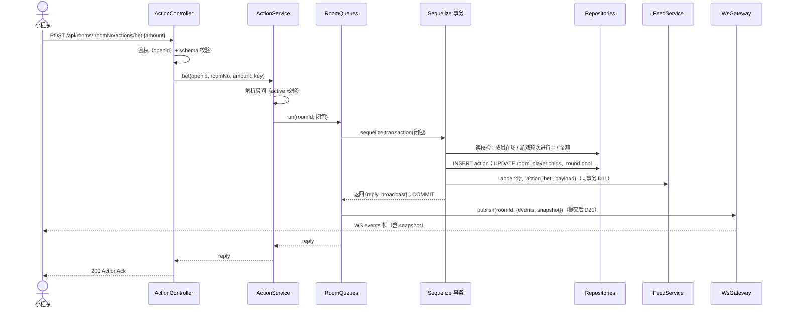
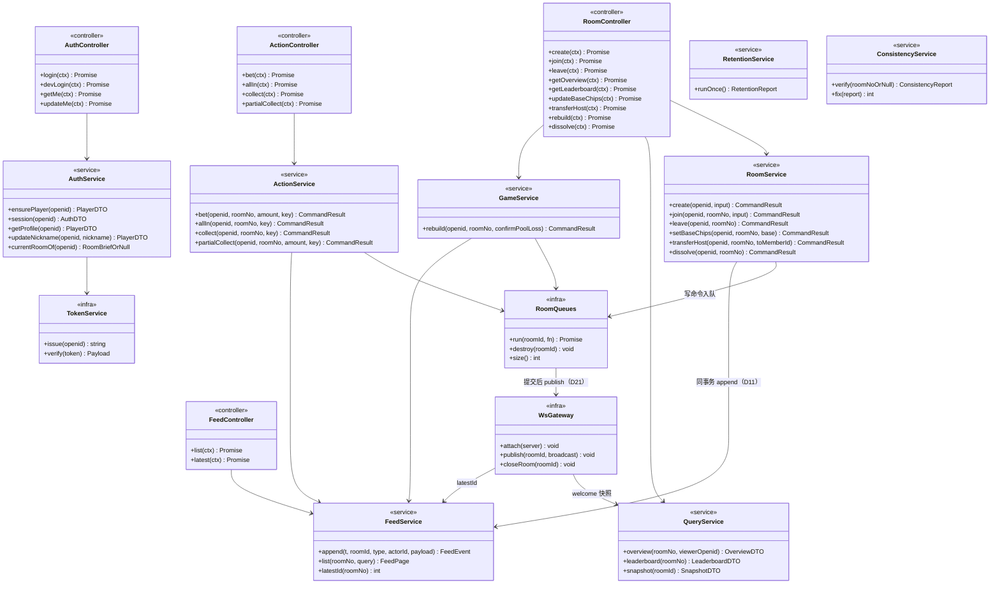
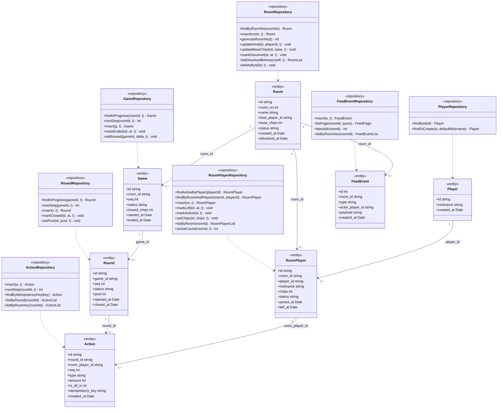

# 筹码计数器 详细设计文档

| 项目 | 内容 |
| --- | --- |
| 文档版本 | v2.1 |
| 发布日期 | 2026-09-18 |
| 文档状态 | 初稿 |
| 设计依据 | [doc/requirements.md](./requirements.md) v2.11（需求规格书）、[doc/design.md](./design.md) v1.5（概要设计） |
| 范围声明 | 服务端（Koa 后端）落地级详细设计：技术栈与版本、数据库 DDL 与 ORM 实体、四层架构（controller / service / repository / entity）、UML 类图、REST / WebSocket 全量接口、关键流程细化、测试设计、**编码执行 PLAN**。本文档即概设 §1.2 中"另行输出的接口设计"的承载者。小程序客户端仅给出页面清单与联调契约（§10 M7），其详细 UI 设计另行输出。部署形态：**微信云托管**（容器化、单实例锁定，D23）；存储：**MySQL 5.7.44**（D13） |

---

## 1. 引言

### 1.1 目的

将概要设计（design.md v1.4）落为可直接编码的实现设计：确定依赖版本、目录结构、每一张表的 DDL 与 ORM 映射、每一个类的方法签名、每一个接口的报文与错误码、每一条关键流程的实现步骤，并给出按里程碑组织的编码执行计划。

### 1.2 继承的设计底线

概设 §1.2 的五条设计底线与 D1~D12 决策全部继承，本文不重复论证；涉及实现取舍处以"概设决策 → 落地方式"对应表（§1.4）与新增决策 D13~D23（§2.2）承接。

### 1.3 读者

后端开发、小程序端开发、测试。

### 1.4 与概要设计的落地适配

概要设计 v1.5 已确定部署形态（微信云托管、单实例锁定）与存储（MySQL 5.7.44），本文与其一致；以下为概设表设计落地到 MySQL 时的实现适配与本文新承载的范围：

| 项 | 概要设计（v1.5） | 详细设计（本文） | 说明 |
| --- | --- | --- | --- |
| 建表方式 | §5.2 表设计（CHECK / 部分唯一索引） | 手写 DDL（`schema_migrations` 版本表，D14）；CHECK → **ENUM + UNSIGNED + 服务层校验**；部分唯一索引 → **生成列 + 唯一索引** | MySQL 5.7 解析但忽略 CHECK；不支持部分唯一索引；Sequelize sync 亦无法表达（§3.2） |
| 时间列 | `*_at` TEXT（UTC ISO8601） | `DATETIME(3)` 存 UTC（连接时区 `'+00:00'`） | 语义等价（NFR-10），见 §3.1/§3.2 |
| 接口设计 | 明确不在概设范围 | 本文 §6 全量定义（REST + WebSocket + 事件 payload + 错误码） | 概设声明的"另行输出"即本文 |
| 定时任务实现 | "定时任务每小时执行" | **node-cron**（`0 * * * *` 每小时整点）+ 启动后延迟 30s 首跑 | 成熟 cron 库，整点对齐、调度语义标准化 |

概设决策 D1~D12 与本文新增 D13~D22 的完整对照见 §2.2。

---

## 2. 技术选型与工程约定

### 2.1 最终技术栈（含版本）

| 项 | 选型 | 版本 | 说明 |
| --- | --- | --- | --- |
| 运行时 | Node.js | ≥ 18（建议 20 LTS） | 复用现有骨架；使用内置 `crypto.randomUUID()`、`node --test`；容器内监听 `PORT` 环境变量指定端口 |
| 包管理 | pnpm | 10.x | 仓库已锁定 `packageManager: pnpm@10.34.1` |
| 模块体系 | ESM（`"type": "module"`） | — | 已定；全仓库一律 named export |
| Web 框架 | koa | ^3.2 | 已装 |
| 路由 | @koa/router | ^15 | 已装；统一前缀 `/api` |
| 请求体 | @koa/bodyparser | ^6 | 已装；仅 JSON，`jsonLimit: '16kb'` |
| ORM | sequelize | ^6.37 | `dialect: 'mysql'`；v7 仍 beta，不用 |
| 数据库 | MySQL | 5.7.44 | 云托管数据库（或自建云 MySQL）；InnoDB / utf8mb4；DDL 以 5.7.44 为兼容基线（8.x 亦可运行） |
| 数据库驱动 | mysql2 | ^3.11 | 纯 JS 实现，无原生编译依赖；Sequelize v6 MySQL 方言驱动 |
| 实时推送 | ws | ^8.18 | Node 生态 WebSocket 事实标准（Socket.IO 底层 engine.io 亦基于 ws）；`WebSocketServer({ noServer: true })` 挂载 Koa HTTP server 的 upgrade 事件。小程序端经 `wx.cloud.connectContainer`（云通道标准 WebSocket，基础库 ≥ 2.23.0）接入，不引入 Socket.IO 私有协议（接入方式见 §6.3） |
| 定时任务 | node-cron | ^4 | 主流 cron 调度库（5/6 段表达式、timezone、Task 可 start/stop）；`0 * * * *` 每小时整点（§7.6）。零依赖备选：croner |
| 部署 | 微信云托管 | — | Docker 镜像交付；**最大实例数=1**（D23）；最小实例数默认 0（缩容到 0，冷启动秒级）；数据库与服务同环境内网互通 |
| ID / 随机 | node:crypto | 内置 | `randomUUID()`、`randomInt()`；不引入 uuid 包 |
| 微信 API | 云通道免鉴权 | — | callContainer 自动注入 `x-wx-openid` 等身份头（§7.1）；无需 code2Session / appid / secret，不引入 HTTP 客户端 |
| 测试 | node:test + supertest | ^7 | 内置 runner + HTTP 断言；不引入 jest |
| 代码规范 | eslint（flat config）+ prettier | ^9 / ^3 | devDependencies |

新增依赖安装命令（M0 执行）：

```bash
pnpm add sequelize@^6.37 mysql2@^3.11 ws@^8.18 node-cron@^4
pnpm add -D supertest@^7 eslint@^9 prettier@^3
```

### 2.2 设计决策（D13~D23，承接概设 D1~D12）

| 编号 | 决策 | 说明 |
| --- | --- | --- |
| D13 | **存储与 ORM**：MySQL 5.7.44 + Sequelize v6（mysql2 驱动），InnoDB / utf8mb4 | 承接概设 §2.1 技术选型；事务用 `sequelize.transaction(async (t) => …)` 托管模式 |
| D14 | **Schema 手写 DDL 引导**：`src/db/migrations/schema.vN.sql` + `init.js` 按 `schema_migrations` 版本表顺序执行；Sequelize 模型映射既有表，`sync()` 永不执行 | 保留 ENUM / UNSIGNED / 生成列唯一索引等 DDL 级约束；迁移即"追加编号 SQL 文件" |
| D15 | **并发与串行化**：MySQL 连接池常规配置（max 10）；写命令串行化由 **D3 房间队列（业务层）+ 部署层单实例锁定（D23）** 承担；INV-7 由生成列唯一索引兜底（§3.2） | InnoDB 行级锁天然支持跨房间并发写，唯一性冲突由索引收口（§3.5）；持久化（NFR-03）由 InnoDB 事务（默认 trx_commit=1）与云数据库自动备份承接 |
| D16 | **身份与令牌**：REST 每请求直接读云通道注入的 `x-wx-openid` 头（免令牌）；HMAC 无状态令牌仅用于 **WS hello 帧**（`POST /auth/session` 换取），TTL 30 天 | callContainer 免鉴权（平台注入身份，服务不开公网访问即不可伪造，D23）；令牌无会话表、无内存态（D10） |
| D17 | **只读围观**：任何持有有效令牌的身份，凭房间号即可读总览 / 筹码榜 / 公屏 / 订阅 WS；**写操作**才要求在场成员 / 房主 | 承接需求 §2.4 场景 6"任何人随时查看公屏"与 FR-602 大屏场景；一人一房间（INV-7）只约束"成员关系"，不约束"旁观" |
| D18 | **开发身份模拟**：`devMode=true`（默认 false）时 auth 中间件接受 `x-dev-openid` 头作为身份，等价模拟云通道注入 | 本地联调与自动化测试无法走微信云通道；生产必须关闭且不开公网访问 |
| D19 | **快捷档位随总览下发**：总览响应含 `betOptions`（D6 六档），服务端为唯一计算来源 | 客户端不重复实现档位规则；房间无快捷值配置项（AC-03） |
| D20 | **回归重发判定**：加入时若存在 `status='left'` 的成员记录，比较 `当前游戏.started_at > 该成员.left_at` → 按本金重发并计入 `issued_chips`；否则恢复定格筹码 | FR-103 的可计算化；无需新增存储列 |
| D21 | **CommandResult 统一命令产物**：事务闭包返回 `{ reply, broadcast: { events, snapshot } \| null }`；`RoomQueues.run` 在**事务提交后**统一调 `WsGateway.publish` | D11（同事务落库、提交后广播）的代码级落地形态；服务层不直接触碰 WS |
| D22 | **统一错误包络**：`{ "error": { "code", "message", "details?" } }`；HTTP 语义 400 参数 / 401 未认证 / 403 无权限 / 404 不存在 / 409 业务状态冲突 / 500 内部 | 错误码全表见 §6.5 |
| D23 | **微信云托管部署**：Docker 镜像交付；**最大实例数固定 1**（内存房间队列与 WS 频道广播依赖单进程，多实例即失效）；最小实例数默认 0（缩容到 0，冷启动秒级 + 客户端重连兜底 §7.5），可按牌局时段定时扩缩容或设最小 1 常驻；数据库与服务同环境内网互通；**服务不开公网访问**（`x-wx-*` 头仅云通道可信） | 承接 NFR-07 v2.11；弹性伸缩扩到多实例会破坏单实例语义，故锁定 |

概设 D1~D12 落地对照（摘要）：D1 房间号→`crypto.randomInt(100000, 1000000)` 重试；D2 openid→云通道注入（§7.1）；D3 队列→§4.3；D4/D5 缓存列→§3.2 + 服务层同事务更新；D6→`common/quickBets.js`（§7.4.1）；D7 无撤销→action 无 update/delete 路径（仓储层不提供该方法）；D8→§7.6；D9 小程序→§10 M7；D10 无内存主数据→启动即从库恢复、队列懒创建；D11 outbox→D21；D12→§7.7。

### 2.3 目录结构

```
chips-counter/
├── package.json
├── config.example.json          # 配置样例（入库）；实际 config.json gitignore
├── Dockerfile                   # 云托管镜像构建（多阶段、非 root，M8）
├── docker-compose.yml           # 本地开发/测试：MySQL 5.7.44 + 服务
├── doc/
│   ├── requirements.md
│   ├── design.md
│   └── detailed-design.md       # 本文
├── src/
│   ├── index.js                 # 组合根：装配一切并启动（唯一 new 的地方，§4.4）
│   ├── app/
│   │   ├── app.js               # createApp(ctx) → { app, server }（Koa 工厂 + WS 挂载）
│   │   ├── routes.js            # 全部路由 → controller 方法
│   │   └── middlewares/
│   │       ├── error.js         # AppError → HTTP；未知异常 500 + 日志
│   │       ├── auth.js          # Bearer 解析 → ctx.state.openid
│   │       └── requestLog.js    # method/path/status/耗时/openid
│   ├── config/index.js          # config.json + 环境变量覆盖 + 冻结导出
│   ├── db/
│   │   ├── sequelize.js         # 实例（mysql2 连接池、UTC 时区、日志桥接）
│   │   ├── init.js              # schema_migrations 版本化迁移执行器（幂等，启动时调用）
│   │   └── migrations/
│   │       └── schema.v1.sql    # 全量 DDL · MySQL 5.7 兼容（§3.2）
│   ├── entities/                # entity 层：7 个 Sequelize 模型 + 关联
│   │   ├── player.js  room.js  roomPlayer.js  game.js
│   │   ├── round.js  action.js  feedEvent.js
│   │   └── index.js             # define + belongsTo/hasMany 关联 + 导出 models
│   ├── repositories/            # repository 层：SQL 全部收口于此
│   │   ├── playerRepository.js      roomRepository.js
│   │   ├── roomPlayerRepository.js  gameRepository.js
│   │   ├── roundRepository.js       actionRepository.js
│   │   └── feedEventRepository.js
│   ├── services/                # service 层：业务校验与状态变更
│   │   ├── authService.js       roomService.js
│   │   ├── gameService.js       actionService.js
│   │   ├── feedService.js       queryService.js
│   │   ├── retentionService.js  consistencyService.js
│   ├── controllers/             # controller 层：参数校验/鉴权透传/调用/序列化
│   │   ├── authController.js    roomController.js
│   │   ├── actionController.js  feedController.js
│   ├── queue/
│   │   └── roomQueues.js        # 房间级串行队列 + 事务 + 提交后广播（D3/D21）
│   ├── ws/
│   │   └── gateway.js           # WS 网关：hello/welcome、频道、心跳、publish
│   ├── jobs/
│   │   └── retentionJob.js      # node-cron 定时清理（0 * * * *）
│   ├── scripts/
│   │   └── verifyConsistency.js # 一致性重算 CLI（D12）
│   └── common/
│       ├── errors.js            # AppError + 错误码枚举（§6.5 的代码源）
│       ├── logger.js  validator.js  token.js
│       ├── ids.js  clock.js  quickBets.js
└── test/
    ├── helpers/app.js           # 测试装配：临时库 + devMode + supertest
    ├── quickBets.test.js  auth.test.js  room.test.js
    ├── action.test.js     feed.test.js   ws.test.js
    └── consistency.test.js
```

### 2.4 编码约定

| 约定 | 内容 |
| --- | --- |
| 分层依赖 | **controller → service → repository → entity**，单向依赖；controller 不 import repository，service 不 import controller，repository 不 import service；跨层只允许 service → feedService（同事务写公屏，D11）与 service → 通用工具 |
| 事务传递 | repository 的**所有写方法与事务内读方法**必须接受可选参数 `t`，并透传 `{ transaction: t }`；service 命令闭包内的一切读写共用同一 `t`；纯查询路径不传 `t`（单语句查询无跨语句一致性需求） |
| 导出 | 一律 named export；模块无副作用（`entities/index.js` 的 define 由组合根显式调用） |
| 命名 | 文件小驼峰；类 PascalCase；常量全大写；数据库列/模型属性统一 snake_case（与列名一致，免映射心智） |
| 时间 | 业务代码取 `clock.now()`（Date，UTC 语义由连接时区 `'+00:00'` 保证），Sequelize 落 DATETIME(3)；对外 DTO 一律 `toISOString()`（UTC ISO8601）；展示时区由客户端处理（NFR-10） |
| 错误 | service/repository 只 `throw new AppError(code, …)`；controller **不写 try/catch**（error 中间件统一兜底）；repository 负责把 Sequelize `UniqueConstraintError` 翻译为业务错误码（§3.5） |
| 日志 | `logger.info/warn/error(msg, fields)`；请求日志不含令牌全文与openid全文（脱敏前 6 位） |
| 时间戳列 | Sequelize 模型一律 `timestamps: false, freezeTableName: true`，`*_at` 由 service 显式赋值（与 DDL 完全对齐） |
| 金额 | 全程 JS number（安全整数范围内），入库 INTEGER；所有比较为整数比较（NFR-06） |

### 2.5 配置设计

`config.example.json`（实际 `config.json` 被 gitignore，字段可被环境变量覆盖）：

```json
{
  "port": 3000,
  "retentionDays": 90,
  "authTokenSecret": "CHANGE_ME",
  "tokenTtlDays": 30,
  "mysql": { "host": "127.0.0.1", "port": 3306, "user": "chips", "password": "", "database": "chips_counter" },
  "devMode": false
}
```

| 配置项 | 环境变量覆盖 | 默认 | 校验 |
| --- | --- | --- | --- |
| port | PORT | 3000 | 1024~65535；云托管部署时由平台环境变量注入 |
| retentionDays | RETENTION_DAYS | 90 | ≥ 1 |
| authTokenSecret | AUTH_TOKEN_SECRET | 无 | 非空且 ≠ `CHANGE_ME`，否则**启动告警**（devMode 下允许随机生成临时密钥并 warn） |
| tokenTtlDays | — | 30 | ≥ 1 |
| mysql.* | MYSQL_HOST / MYSQL_PORT / MYSQL_USER / MYSQL_PASSWORD / MYSQL_DATABASE | 见样例 | 必填；云托管经**服务环境变量**注入，与数据库同环境内网互通（生产凭据不落代码库） |
| devMode | DEV_MODE | false | 布尔；true 时接受 `x-dev-openid` 身份头（D18） |
| （部署参数） | — | — | 实例数（最大=1 / 最小=0）、定时扩缩容、公网访问开关、健康检查路径在**云托管控制台**配置，不入 config.json（D23） |

`config/index.js` 启动时一次性读取、深冻结导出；运行期不重载。

---

## 3. 数据库详细设计

### 3.1 连接与参数（D15 修订）

`src/db/sequelize.js` 关键参数（设计约束，非最终代码）：

- `new Sequelize({ dialect: 'mysql', host, port, username, password, database, pool: { max: 10, min: 0, idle: 10000, acquire: 30000 }, timezone: '+00:00', define: { charset: 'utf8mb4', collate: 'utf8mb4_general_ci' }, logging: msg => logger.debug(msg) })`；
- 启动流程：`await sequelize.authenticate()` → `db/init.js` 执行版本化迁移（§3.3）；
- `sql_mode` 保持 5.7.44 默认严格模式（含 STRICT_TRANS_TABLES，不得放宽）：ENUM 非法值、UNSIGNED 越界即报错，约束不静默失效；
- 时间：连接时区固定 `'+00:00'`，DATETIME(3) 存 UTC 毫秒，Sequelize ↔ JS Date 双向自动转换；
- 并发模型：连接池常规配置，**同一房间**写命令由 D3 房间队列串行（保序 + 校验-写入原子），**跨房间**命令并发执行、InnoDB 行级锁互不阻塞，唯一性冲突（并发加入不同房间等）由唯一索引收口（§3.5）；
- 持久化（NFR-03）：InnoDB 默认 `innodb_flush_log_at_trx_commit=1`（提交即落盘，不得调低）；云托管数据库由平台负责高可用与自动备份。

### 3.2 schema.v1.sql（MySQL 5.7.44 兼容 DDL）

```sql
-- 筹码计数器 schema v1（与概设 §5.2 逐项对齐；InnoDB / utf8mb4，MySQL 5.7.44 兼容基线）
CREATE TABLE IF NOT EXISTS schema_migrations (
  version    INT UNSIGNED NOT NULL PRIMARY KEY,
  applied_at DATETIME(3) NOT NULL
) ENGINE=InnoDB DEFAULT CHARSET=utf8mb4;

CREATE TABLE IF NOT EXISTS player (
  id         VARCHAR(64) NOT NULL,             -- 微信 openid（D2，云通道注入）
  nickname   VARCHAR(64) NOT NULL,
  created_at DATETIME(3) NOT NULL,
  PRIMARY KEY (id)
) ENGINE=InnoDB DEFAULT CHARSET=utf8mb4;

CREATE TABLE IF NOT EXISTS room (
  id             CHAR(36)     NOT NULL,
  room_no        INT UNSIGNED NOT NULL,        -- 6 位房间号（D1）
  name           VARCHAR(128) NOT NULL,
  host_player_id VARCHAR(64)  NOT NULL,
  base_chips     INT UNSIGNED NOT NULL,        -- ∈预设值由服务层校验（5.7 CHECK 不生效）
  status         ENUM('active','dissolved') NOT NULL,
  created_at     DATETIME(3) NOT NULL,
  dissolved_at   DATETIME(3) NULL,
  PRIMARY KEY (id),
  UNIQUE KEY uniq_room_no (room_no),
  KEY idx_room_cleanup (status, dissolved_at),           -- 保留期清理扫描
  CONSTRAINT fk_room_host FOREIGN KEY (host_player_id) REFERENCES player(id)
) ENGINE=InnoDB DEFAULT CHARSET=utf8mb4;

CREATE TABLE IF NOT EXISTS room_player (
  id         CHAR(36)    NOT NULL,
  room_id    CHAR(36)    NOT NULL,
  player_id  VARCHAR(64) NOT NULL,
  nickname   VARCHAR(64) NOT NULL,
  chips      INT UNSIGNED NOT NULL DEFAULT 0,
  status     ENUM('active','left') NOT NULL,
  joined_at  DATETIME(3) NOT NULL,
  left_at    DATETIME(3) NULL,
  -- 一人一房间（INV-7）：生成列 + 唯一索引，等价 partial unique index
  active_player_key VARCHAR(64)
    AS (CASE WHEN status = 'active' THEN player_id ELSE NULL END) STORED,
  PRIMARY KEY (id),
  UNIQUE KEY uniq_room_member (room_id, player_id),
  UNIQUE KEY uniq_room_nickname (room_id, nickname),     -- utf8mb4_general_ci 大小写不敏感
  UNIQUE KEY uniq_room_player_active (active_player_key),
  CONSTRAINT fk_rp_room   FOREIGN KEY (room_id)   REFERENCES room(id)   ON DELETE CASCADE,
  CONSTRAINT fk_rp_player FOREIGN KEY (player_id) REFERENCES player(id) ON DELETE CASCADE
  -- 实现修订（M0 编码时发现）：MySQL 5.7 不允许 STORED 生成列（active_player_key）的表达式引用
  -- 带外键约束的列（errno 150 "Cannot add foreign key constraint"），两约束不能并存。
  -- 实际 schema 落地去掉 fk_rp_player：player 存在性由服务层保证（ensurePlayer 先于加入），
  -- 保留期清理的级联删除由 fk_rp_room 承接（系统从不删除 player 行）。见 src/db/migrations/schema.v1.sql。
) ENGINE=InnoDB DEFAULT CHARSET=utf8mb4;

CREATE TABLE IF NOT EXISTS game (
  id            CHAR(36)     NOT NULL,
  room_id       CHAR(36)     NOT NULL,
  seq           INT UNSIGNED NOT NULL,
  status        ENUM('in_progress','ended') NOT NULL,
  issued_chips  INT UNSIGNED NOT NULL DEFAULT 0,
  started_at    DATETIME(3) NOT NULL,
  ended_at      DATETIME(3) NULL,
  PRIMARY KEY (id),
  UNIQUE KEY uniq_room_game_seq (room_id, seq),
  CONSTRAINT fk_game_room FOREIGN KEY (room_id) REFERENCES room(id) ON DELETE CASCADE
) ENGINE=InnoDB DEFAULT CHARSET=utf8mb4;

CREATE TABLE IF NOT EXISTS round (
  id         CHAR(36)     NOT NULL,
  game_id    CHAR(36)     NOT NULL,
  seq        INT UNSIGNED NOT NULL,
  status     ENUM('in_progress','closed') NOT NULL,
  pool       INT UNSIGNED NOT NULL DEFAULT 0,
  opened_at  DATETIME(3) NOT NULL,
  closed_at  DATETIME(3) NULL,
  PRIMARY KEY (id),
  UNIQUE KEY uniq_game_round_seq (game_id, seq),
  CONSTRAINT fk_round_game FOREIGN KEY (game_id) REFERENCES game(id) ON DELETE CASCADE
) ENGINE=InnoDB DEFAULT CHARSET=utf8mb4;

CREATE TABLE IF NOT EXISTS action (
  id              CHAR(36)     NOT NULL,
  round_id        CHAR(36)     NOT NULL,
  room_player_id  CHAR(36)     NOT NULL,
  seq             INT UNSIGNED NOT NULL,
  type            ENUM('bet','collect','partial_collect') NOT NULL,
  amount          INT UNSIGNED NOT NULL,       -- >0 由服务层校验（UNSIGNED 拒绝负数）
  is_all_in       TINYINT UNSIGNED NOT NULL DEFAULT 0,
  idempotency_key VARCHAR(64) NULL,
  created_at      DATETIME(3) NOT NULL,
  PRIMARY KEY (id),
  UNIQUE KEY uniq_round_action_seq (round_id, seq),
  UNIQUE KEY uniq_action_idempotency (idempotency_key),  -- 唯一索引允许多个 NULL，等价部分唯一
  KEY idx_action_member (room_player_id),
  CONSTRAINT fk_action_round  FOREIGN KEY (round_id)       REFERENCES round(id)       ON DELETE CASCADE,
  CONSTRAINT fk_action_member FOREIGN KEY (room_player_id) REFERENCES room_player(id) ON DELETE CASCADE
) ENGINE=InnoDB DEFAULT CHARSET=utf8mb4;

CREATE TABLE IF NOT EXISTS feed_event (
  id              BIGINT UNSIGNED NOT NULL AUTO_INCREMENT,  -- 房间内游标（断线补拉）
  room_id         CHAR(36)    NOT NULL,
  type            VARCHAR(32) NOT NULL,                     -- 枚举在应用层（§6.4），便于扩展
  actor_player_id VARCHAR(64) NULL,
  payload         TEXT        NOT NULL,                     -- JSON（§6.4）
  created_at      DATETIME(3) NOT NULL,
  PRIMARY KEY (id),
  KEY idx_feed_room  (room_id, id),
  KEY idx_feed_actor (room_id, actor_player_id),
  KEY idx_feed_type  (room_id, type),
  CONSTRAINT fk_feed_room  FOREIGN KEY (room_id)         REFERENCES room(id) ON DELETE CASCADE,
  CONSTRAINT fk_feed_actor FOREIGN KEY (actor_player_id) REFERENCES player(id)
) ENGINE=InnoDB DEFAULT CHARSET=utf8mb4;
```

与概设 §5.2 的对照说明（约束表达方式的变化）：

- **CHECK 约束在 MySQL 5.7 被解析但忽略**，按语义拆解承接：可枚举约束（status / type）→ `ENUM`（严格模式下非法值即报错）；非负约束（chips / pool / issued_chips / amount）→ `UNSIGNED`（拒绝负数与越界）；其余（`base_chips ∈ 预设`、`amount > 0`、`is_all_in ∈ {0,1}`、`partial_collect.amount < pool`、`collect.amount = 收池时整池`、发起成员在场等）由 service 校验链在**同一事务内**兜底（§7.4，即概设 §5.2 表 6 的落点）；
- **部分唯一索引 → 生成列 + 唯一索引**：一人一房间（INV-7）用 `active_player_key` 生成列实现（`CASE WHEN status='active' THEN player_id ELSE NULL END`，唯一索引允许多个 NULL，语义等价于"仅 active 行参与唯一约束"）；幂等键唯一直接用普通唯一索引（NULL 可重复）；
- 所有 UNIQUE、外键级联删除与概设 §5.2 一致；`action.room_player_id` 承接概设 v1.4 的成员归属修订；
- 时间列概设为"UTC ISO8601 文本"，MySQL 落地为 `DATETIME(3)` 存 UTC（连接时区 `'+00:00'`，§3.1），语义等价（NFR-10）；
- 房间内昵称唯一性按 `utf8mb4_general_ci` **大小写不敏感**（"abc" 与 "ABC" 视为重名；如需精确二进制匹配改 `utf8mb4_bin`，当前产品语义取不敏感）；
- 重建时旧轮次以非零池关闭：`round.pool` 保留封存值（概设 §6.4），UNSIGNED 约束不受影响。

### 3.3 版本化迁移

- `db/init.js`：读 `schema_migrations` 已应用版本 → 依次执行未应用的 `migrations/schema.v{N}.sql`（每个文件的执行与版本记录写入在同一事务内）；
- 全部 DDL 使用 `IF NOT EXISTS`，执行幂等；版本号只前进不回滚（无降级需求）；
- v2+ 迁移规则：只允许**追加**新编号 SQL 文件，禁止修改已发布文件。

### 3.4 Sequelize 实体映射（entity 层）

约定：`sequelize.define(<name>, <attrs>, { tableName: <name>, timestamps: false, freezeTableName: true })`；属性名 = 列名；`DataTypes.DATE(3)` 在 MySQL 方言落 `DATETIME(3)`。示例（player，其余同构）：

```js
// entities/player.js（示例，展示约定；完整字段见下表）
export const definePlayer = (sq) => sq.define('player', {
  id:         { type: DataTypes.STRING(64), primaryKey: true },
  nickname:   { type: DataTypes.STRING(64), allowNull: false },
  created_at: { type: DataTypes.DATE(3), allowNull: false },
}, { tableName: 'player', timestamps: false, freezeTableName: true });
```

字段映射总表（列名 → Sequelize 类型 / 键）：

| 实体 | 主键 | 字段（类型） | 关联（模型层，便于 include） |
| --- | --- | --- | --- |
| player | id STRING(64) | nickname STRING(64)，created_at DATE(3) | hasMany room_player / feed_event |
| room | id CHAR(36) | room_no INTEGER.UNSIGNED(UNIQUE)，name STRING(128)，host_player_id STRING(64)(FK player)，base_chips INTEGER.UNSIGNED，status ENUM('active','dissolved')，created_at DATE(3)，dissolved_at DATE(3) NULL | hasMany room_player / game / feed_event；belongsTo player(as host) |
| room_player | id CHAR(36) | room_id FK，player_id FK，nickname STRING(64)，chips INTEGER.UNSIGNED，status ENUM('active','left')，joined_at DATE(3)，left_at DATE(3) NULL；**active_player_key 生成列不映射不写入** | belongsTo room / player；hasMany action |
| game | id CHAR(36) | room_id FK，seq INTEGER.UNSIGNED，status ENUM，issued_chips INTEGER.UNSIGNED，started_at DATE(3)，ended_at DATE(3) NULL | belongsTo room；hasMany round |
| round | id CHAR(36) | game_id FK，seq INTEGER.UNSIGNED，status ENUM，pool INTEGER.UNSIGNED，opened_at DATE(3)，closed_at DATE(3) NULL | belongsTo game；hasMany action |
| action | id CHAR(36) | round_id FK，room_player_id FK，seq INTEGER.UNSIGNED，type ENUM('bet','collect','partial_collect')，amount INTEGER.UNSIGNED，is_all_in TINYINT.UNSIGNED，idempotency_key STRING(64) NULL，created_at DATE(3) | belongsTo round / room_player |
| feed_event | id BIGINT AUTOINCREMENT | room_id FK，type STRING(32)，actor_player_id STRING(64) NULL，payload TEXT(JSON)，created_at DATE(3) | belongsTo room / player |

> ENUM 在模型层用 `DataTypes.ENUM` 同步声明（与 DDL 双保险）；其余 unique/validate 不在模型层重复（避免双重来源漂移），唯一性错误由 repository 翻译（§3.5）。

### 3.5 数据库约束错误翻译（repository 职责）

MySQL 唯一冲突：`Sequelize.UniqueConstraintError`，`original.code === 'ER_DUP_ENTRY'`，按冲突索引名（`original.message` / `fields`）分类翻译：

| 冲突索引 | 翻译为（§6.5） |
| --- | --- |
| `uniq_room_player_active`（fields.active_player_key） | `ALREADY_IN_ROOM`（INV-7 数据库兜底；跨房间并发加入的竞态在此收口，§7.3） |
| `uniq_room_member`（room_id + player_id） | 加入路径：已有 left 记录 → 回归分支；已有 active → `ALREADY_IN_ROOM` |
| `uniq_room_nickname` | `NICKNAME_TAKEN` |
| `uniq_room_no` | 仅建房房间号碰撞：内部重试（≤ 5 次），不外抛 |
| `uniq_action_idempotency` | 幂等复用路径（§7.4.4），非错误 |
| `uniq_room_game_seq` / `uniq_game_round_seq` / `uniq_round_action_seq` | 理论不可达（房间队列串行分配 seq，D3）→ 500 + error 日志 |

### 3.6 备份

- **云托管数据库**：控制台自动备份（平台能力，按策略保留），恢复走平台流程；发布/迁移前可手动触发一次全量备份；
- **自建云 MySQL（如选用）**：`mysqldump --single-transaction` 定时脚本 + 云盘快照（M5 交付可选脚本）；
- 恢复后无需回放：所有状态（含缓存列）均在库中，启动即恢复（D10）。

---

## 4. 后端分层架构

### 4.1 四层结构与概设层次对照

| 概设层次（§3.2） | 本设计落点 | 职责边界 |
| --- | --- | --- |
| REST 接入层 | **controller 层** + `middlewares` + `routes.js` | 参数解析与校验（schema 级）、身份透传（`ctx.state.openid`）、调用 service、把结果/错误序列化为 HTTP 响应。**不含业务规则** |
| 业务服务层 | **service 层**（含 feedService/queryService） | 业务校验（在场/房主/金额/状态）、状态变更编排、同事务写公屏（D11）、产出 CommandResult（D21）。**不写 SQL、不碰 HTTP/WS** |
| 数据访问层 | **repository 层** + `queue/roomQueues.js`（事务与串行化基础设施）+ `jobs` | SQL 全部收口；约束错误翻译（§3.5）；seq 分配（`max+1`，事务内） |
| 存储 | **entity 层**（Sequelize 模型）+ MySQL | 唯一事实来源（D10） |

横切设施（不属于四层）：`ws/gateway.js`（仅被 roomQueues 与自身连接管理使用）、`common/*`、`config`、`db`。

### 4.2 请求 / 命令统一管线

**写命令**（建房、加入、离开、设置、移交、解散、重建、四种动作）统一走：

1. middleware：error → bodyparser → requestLog → auth（→ openid）；
2. controller：schema 校验（validator）→ 调用 `xxxService.cmd(...)`；
3. service 命令方法内部：解析房间（roomNo → room，校验 active）→ `roomQueues.run(roomId, 事务闭包)`；
4. 闭包内（事务中）：业务校验 → repository 变更 → `feedService.append(t, ...)` 同事务写公屏 → 返回 `{ reply, broadcast }`；
5. `roomQueues` 提交事务 → 若有 `broadcast` 则 `wsGateway.publish(roomId, broadcast)`（D21）；
6. service 返回 `reply` → controller 序列化为 HTTP 响应。

**读查询**（总览、筹码榜、公屏、latest）不进队列、不开事务，直接 repository 读。

### 4.3 房间命令队列（D3 落地）

```js
// queue/roomQueues.js 设计契约
class RoomQueues {
  constructor(sequelize, wsGateway) {}
  /** 将闭包排入 roomId 的 FIFO；闭包在 sequelize 托管事务中执行；
   *  成功提交后若闭包返回 CommandResult.broadcast 则 publish；返回闭包的 reply。
   *  闭包抛错 → 事务回滚 → 错误向调用方透传，队列继续消费后续命令。 */
  async run(roomId, fn) // fn: (t) => Promise<CommandResult>
  destroy(roomId)       // 房间解散/清理后销毁队列（防止泄漏）
  size()                // 观测：活跃队列数（日志/健康检查用）
}
```

- 数据结构：`Map<roomId, Promise>` 尾链（`map.set(id, prev.catch(()=>{}).then(exec))`），**懒创建**：首个命令到达时建链；`destroy` 置入终止哨兵后删除键（D10）；
- 建房命令无既有房间：`roomService.create` 不经队列——建房只与新房间自身数据交互，无跨房间共享状态；房间号唯一冲突由 `generateRoomNo` 重试兜底（§3.5）；
- 队列保证的是**同一房间命令的顺序与校验-写入原子性**；跨房间命令经 MySQL 连接池并发执行，唯一性冲突（并发加入不同房间等）由唯一索引兜底收口（§3.5，D15）。

### 4.4 组合根与依赖注入

`src/index.js` 为唯一装配点（构造注入，无 DI 框架）：

```
config → logger → sequelize(db) → entities(注册) → db.init(版本化迁移)
→ repositories ×7（注入 sequelize / models）
→ wsGateway → roomQueues(sequelize, wsGateway)
→ feedService(repos) → queryService(repos, feedService)
→ authService(token, repos) → roomService(...) → gameService / actionService
→ retentionService → controllers → routes → app(ctx) → server.listen
→ jobs.retentionJob.start()   （server 启动后）
→ SIGTERM：retentionJob.stop() → server.close() → sequelize.close()（云托管发布/缩容前优雅停机）
```

所有部件单例；测试通过 `test/helpers/app.js` 以临时库 + devMode 组装同构实例。

### 4.5 命令管线时序（以"下注"为例）



---

## 5. 类设计（UML）

### 5.1 类图：接入层与业务服务层



### 5.2 类图：数据访问层与实体层



### 5.3 服务方法契约（实现以本表为准）

| 服务.方法 | 事务 | 前置校验（失败抛码） | 状态变更（同一事务） | reply / broadcast |
| --- | --- | --- | --- | --- |
| authService.ensurePlayer(openid) / session(openid) | 无 | openid 非空（AUTH_REQUIRED） | INSERT ... ON DUPLICATE KEY 注册（默认昵称"玩家+4 位随机"）；session 另签发 WS 令牌（D16） | — |
| roomService.create(openid, {name?, baseChips, nickname?}) | 有（不经队列，§4.3） | openid 无 active 成员（ALREADY_IN_ROOM）；baseChips ∈ 预设（BASE_CHIPS_INVALID） | insert room/room_player(chips=base)/game(seq=1, issued=base)/round(seq=1)（player 注册已由入口 ensurePlayer 完成）；feed: room_created + game_started + round_opened | reply=Overview；broadcast=3 事件+snapshot |
| roomService.join(openid, roomNo, {nickname?}) | 有（入队） | 房间存在（ROOM_NOT_FOUND）、active（ROOM_DISSOLVED）；INV-7（§7.3）；昵称唯一（NICKNAME_TAKEN） | 新成员：insert room_player + game.addIssued(base) + feed player_joined；回归：D20 判定 → setChips(恢复或重发)+addIssued(重发时) + feed player_returned | reply=Overview；broadcast |
| roomService.leave(openid, roomNo) | 有（入队） | 房间 active；openid 为 active 成员（NOT_MEMBER） | markLeft(left_at=now) + feed player_left（筹码不动） | reply=204；broadcast |
| roomService.setBaseChips(openid, roomNo, base) | 有（入队） | active；房主（NOT_HOST / NOT_MEMBER）；预设值 | update room.base_chips + feed setting_changed（仅影响后续游戏） | reply={baseChips}；broadcast |
| roomService.transferHost(openid, roomNo, toMemberId) | 有（入队） | active；房主；目标为**在场**其他成员（TRANSFER_TARGET_INVALID / TRANSFER_SELF） | update room.host_player_id + feed host_transferred | reply=Overview；broadcast |
| roomService.dissolve(openid, roomNo) | 有（入队） | active；房主 | room.status=dissolved+dissolved_at；当前 game ended、round closed；全部成员 markLeft；feed room_dissolved；队列 destroy | reply=204；broadcast（后 closeChannel 转只读保留连接） |
| gameService.rebuild(openid, roomNo, confirm) | 有（入队） | active；房主；池>0 且未确认 → 抛 REBUILD_CONFIRM_REQUIRED(details.currentPool)（无变更） | 旧 game ended / 旧 round closed(封存池值)；insert game(seq+1, issued=在场数×本金)；active 成员 chips=base（left 成员不动，概设 §6.4 修正）；insert round(seq=1)；feed game_rebuilt + round_opened | reply=Overview；broadcast |
| actionService.bet(openid, roomNo, amount, key) | 有（入队） | §7.4 校验链 | insert action(bet, is_all_in 判定)；chips−amount；pool+amount；feed action_bet | reply=ActionAck；broadcast |
| actionService.allIn(openid, roomNo, key) | 有（入队） | 同上（amount=当前 chips） | 同上（is_all_in=1） | 同上 |
| actionService.collect(openid, roomNo, key) | 有（入队） | 池>0（POOL_EMPTY） | insert action(collect, amount=池)；chips+池；pool=0；旧 round closed；insert round(seq+1)；feed action_collect + round_closed + round_opened | reply=ActionAck(含 newRoundSeq)；broadcast |
| actionService.partialCollect(openid, roomNo, amount, key) | 有（入队） | 0<amount<pool（PARTIAL_GE_POOL） | insert action(partial_collect)；chips+amount；pool−amount；feed action_partial_collect | reply=ActionAck；broadcast |
| feedService.append(t, roomId, type, actorId, payload) | 调用方事务 | — | insert feed_event（payload JSON.stringify） | 供 broadcast 收集 |
| feedService.list(roomNo, q) / latestId(roomNo) | 无 | 房间存在 | — | FeedPage / int |
| queryService.overview(roomNo, viewer) / leaderboard / snapshot | 无 | 房间存在 | — | DTO（§6.4） |
| retentionService.runOnce() | 每房间一个 | — | §7.6 | Report（日志） |
| consistencyService.verify(roomNo?)/fix(r) | 无（离线） | — | §7.7 | Report |

### 5.4 基础设施类

| 类 | 要点 |
| --- | --- |
| common/errors.js | `class AppError extends Error { code, httpStatus, message, details }`；`E = { INVALID_PARAMS:'INVALID_PARAMS', … }` 与 §6.5 一一对应 |
| common/token.js | `issue(openid)` → `b64url({openid,iat,exp}).hmacSha256(secret)`；`verify(token)` → payload 或抛 AUTH_INVALID；exp = iat + tokenTtlDays×86400；**仅用于 WS hello 鉴权**（D16） |
| app/middlewares/auth.js | REST 身份：取云通道注入的 `x-wx-openid` 头（devMode 下接受 `x-dev-openid`，D18）→ `ctx.state.openid`；缺失 → AUTH_REQUIRED |
| common/validator.js | 组合式 schema：`v.obj({ baseChips: v.intEnum(PRESET) , nickname: v.str(1,16) })`；失败抛 INVALID_PARAMS(details=[字段原因]) |
| common/quickBets.js | `PRESET_BASE_CHIPS=[100,200,400,500,800,1000]`；`quickBets(base) = [5,10,20,25,50,100].map(p => floor(base*p/100))` 去重保序（预设本金恒为 6 个正整数，D6） |
| common/ids.js / clock.js | `uuid()`；`now()`（Date，UTC 语义由连接时区保证） |
| common/logger.js | 分级 + ISO 时间 + 字段对象；error 级别附带 stack |
| ws/gateway.js | §6.3 |

---

## 6. 接口设计

### 6.1 通用约定

| 项 | 约定 |
| --- | --- |
| Base | `http://<host>:<port>/api`；WS：`ws://<host>:<port>/ws` |
| 认证 | REST：身份取自云通道注入的 `x-wx-openid` 头（devMode 下接受 `x-dev-openid` 模拟，D18；缺失 401 AUTH_REQUIRED）；WS：hello 帧携带 `POST /auth/session` 换取的令牌（401/close 4001：AUTH_INVALID） |
| 内容类型 | 请求与响应均为 `application/json` |
| 路径房间标识 | 一律 `roomNo`（6 位数字） |
| 幂等 | 动作类请求体可携带 `idempotencyKey`（客户端 `randomUUID`，每用户操作一个）；语义见 §7.4.4 |
| 分页（公屏） | `afterId`/`beforeId`（互斥，可省）+ `limit`（默认 50，最大 200）+ `order=asc|desc`（默认 desc）；响应 `hasMore` + `nextCursor` |
| 时间 | 全部 UTC ISO8601 字符串 |
| 错误包络 | `{ "error": { "code", "message", "details" } }`（D22） |
| 生产环境 | HTTPS/WSS + 小程序合法域名（D9）；本地/局域网开发用 devMode |

### 6.2 REST 接口明细

#### A1. POST /api/auth/session —— 建立会话（换取 WS 令牌）

| 项 | 内容 |
| --- | --- |
| 请求 | 空请求体；身份取自云通道注入的 `x-wx-openid` 头（首次自动注册 player，默认昵称"玩家+4 位随机"） |
| 200 | `{ "token": "…（WS hello 用，D16）", "player": { "playerId": "openid", "nickname": "玩家A1B2", "createdAt": "…" } }` |
| 错误 | 401 AUTH_REQUIRED（缺身份头） |
| 需求 | NFR-08、D2/D16 修订 |

> 无独立 dev-login 端点：devMode=true 时全部端点接受 `x-dev-openid` 头模拟云通道注入（D18），行为与生产一致。

#### A2.（保留编号，端点取消）原 dev-login 并入 devMode 身份头，见上注

#### A3. GET /api/auth/me —— 我的档案与所在房间

`200 { "player": {…}, "room": { "roomNo": 843217, "status": "active" } | null }`（room 取该 openid 的 active 成员关系，供小程序冷启动恢复）。

#### A4. PUT /api/auth/me —— 设置默认昵称

请求 `{ "nickname": "1~16 字" }` → `200 { "player": {…} }`；400 NICKNAME_INVALID / INVALID_PARAMS。仅影响**后续**加入房间时的默认昵称；房间内昵称加入后不变（后续需求再议）。

#### R1. POST /api/rooms —— 建房（房主）

| 项 | 内容 |
| --- | --- |
| 请求 | `{ "name?": "≤24 字，缺省=<昵称>的房间", "baseChips": 1000, "nickname?": "房间内昵称，缺省=默认昵称" }` |
| 201 | OverviewDTO（§6.4；`me.isHost=true`） |
| 错误 | 400（BASE_CHIPS_INVALID / INVALID_PARAMS / NICKNAME_INVALID）；409 ALREADY_IN_ROOM / NICKNAME_TAKEN |
| 需求 | FR-101、AC-01；自动开局（FR-201/301） |

#### R2. POST /api/rooms/:roomNo/join —— 加入 / 回归（同一端点）

| 项 | 内容 |
| --- | --- |
| 请求 | `{ "nickname?": "…" }` |
| 200 | OverviewDTO（`me` 填充） |
| 错误 | 404 ROOM_NOT_FOUND；409 ALREADY_IN_ROOM / NICKNAME_TAKEN / ROOM_DISSOLVED |
| 需求 | FR-102、FR-103（回归）、INV-7、AC-02、AC-12；回归重发判定 D20 |

#### R3. POST /api/rooms/:roomNo/leave —— 离开

请求 `{}` → `204`；错误 403 NOT_MEMBER；409 ROOM_DISSOLVED。需求 FR-103、AC-12。

#### R4. GET /api/rooms/:roomNo —— 房间总览（D17：登录即可读）

`200` OverviewDTO；404 ROOM_NOT_FOUND。需求 FR-601、AC-06（守恒字段 issuedChips 供校验）。

#### R5. GET /api/rooms/:roomNo/leaderboard —— 筹码榜

`200 { "ranking": [ { "memberId", "nickname", "chips", "status", "isHost" } ] }`（chips 降序，并列按 joined_at 升序）；404。需求 FR-602。

#### R6. PUT /api/rooms/:roomNo/settings/base-chips —— 设置本金（房主）

请求 `{ "baseChips": 500 }` → `200 { "baseChips": 500, "betOptions": [25,50,100,125,250,500] }`；错误 400 BASE_CHIPS_INVALID；403 NOT_HOST / NOT_MEMBER；409 ROOM_DISSOLVED。需求 FR-104、AC-02（非房主拒绝）、AC-03（无快捷值配置项）。

#### R7. POST /api/rooms/:roomNo/host/transfer —— 移交房主（房主）

请求 `{ "toMemberId": "room_player.id" }` → `200` OverviewDTO；错误 400 TRANSFER_SELF；409 TRANSFER_TARGET_INVALID；403 NOT_HOST。需求 FR-105、AC-09。

#### R8. POST /api/rooms/:roomNo/rebuild —— 重建游戏（房主）

| 项 | 内容 |
| --- | --- |
| 请求 | `{ "confirmPoolLoss?": true }` |
| 200 | OverviewDTO（新游戏） |
| 409 | `REBUILD_CONFIRM_REQUIRED`，`details: { "currentPool": 2700 }` —— 当前池非 0 且未确认（响应即"二次确认提示"，不产生任何变更） |
| 其他错误 | 403 NOT_HOST / NOT_MEMBER；409 ROOM_DISSOLVED |
| 需求 | FR-202/203/204、AC-07；重置范围=仅在场成员（概设 §6.4 修正） |

#### R9. POST /api/rooms/:roomNo/dissolve —— 解散（房主）

请求 `{}` → `204`；403 NOT_HOST；409 ROOM_DISSOLVED（幂等拒绝）。需求 FR-106、AC-09。

#### C1. POST /api/rooms/:roomNo/actions/bet —— 下注（快捷值 / 手动共用）

| 项 | 内容 |
| --- | --- |
| 请求 | `{ "amount": 200, "idempotencyKey?": "uuid" }` |
| 200 | ActionAckDTO：`{ "actionId", "type": "bet", "amount": 200, "isAllIn": false, "chipsAfter": 800, "poolAfter": 200, "gameSeq": 1, "roundSeq": 1 }` |
| 错误 | 400 AMOUNT_INVALID；403 NOT_MEMBER；409 BET_EXCEEDS_CHIPS / ROOM_DISSOLVED / IDEMPOTENCY_CONFLICT |
| 需求 | FR-401/402/407、AC-03、AC-08 |

#### C2. POST /api/rooms/:roomNo/actions/all-in —— 全下

请求 `{ "idempotencyKey?" }`（金额由服务端取当前筹码）→ ActionAckDTO（`isAllIn: true`）；错误同 C1（无 AMOUNT_INVALID）。需求 FR-402。

#### C3. POST /api/rooms/:roomNo/actions/collect —— 收池（自动换轮）

请求 `{ "idempotencyKey?" }` → ActionAckDTO（`poolAfter: 0`，附加 `"newRoundSeq": 2`）；错误 409 POOL_EMPTY（其余同上）。需求 FR-403、FR-302、INV-6、AC-04。

#### C4. POST /api/rooms/:roomNo/actions/partial-collect —— 部分收注

请求 `{ "amount": 1200, "idempotencyKey?" }` → ActionAckDTO；错误 400 AMOUNT_INVALID；409 PARTIAL_GE_POOL（amount ≥ pool，等于整池应用 C3）；其余同上。需求 FR-404/405、AC-05。

#### F1. GET /api/rooms/:roomNo/feed —— 公屏查询 / 断线补拉（D17）

Query：`afterId`（正序补拉）/ `beforeId`（倒序翻页）/ `limit` / `order` / `actor=<playerId>` / `type=action_bet,player_joined`（逗号多选）。

```json
{ "events": [ FeedEventDTO… ], "hasMore": true, "nextCursor": 1053 }
```

`FeedEventDTO`：`{ "id", "type", "actorPlayerId", "actorNickname", "payload": {…}, "createdAt" }`。需求 FR-501/503、AC-13；action 不暴露任何历史端点（FR-503 唯一入口）。

#### F2. GET /api/rooms/:roomNo/feed/latest —— 游标

`200 { "latestEventId": 1053 }`（客户端轻量对齐游标用）。

#### S1. GET /api/health —— 健康检查（云托管探活，免鉴权）

`200 { "status": "ok" }`（内含 `sequelize.authenticate()` 探活，失败 503）。

### 6.3 WebSocket 协议

**连接**：服务端 `noServer` 挂载 upgrade（仅接受路径 `/ws`）。生产环境客户端经 `wx.cloud.connectContainer({ path: '/ws' })` 接入（云通道终止 WSS，基础库 ≥ 2.23.0）；本地联调直连 `ws://localhost:<port>/ws`。

**帧协议**（JSON 文本帧）：

| 方向 | type | 字段 | 说明 |
| --- | --- | --- | --- |
| C→S | `hello` | `token`（A1 换取）, `roomNo` | **必须为首帧**，10s 内未收到则 close(4002) |
| S→C | `welcome` | `snapshot`: SnapshotDTO, `latestEventId`, `serverTime` | 订阅成功；客户端比对本地游标决定是否 REST 补拉（§7.5） |
| S→C | `events` | `events`: FeedEventDTO[], `snapshot`: SnapshotDTO | 每个已提交事务一批；事件按 id 升序；客户端按 id 去重推进游标 |
| C→S | `ping` | `ts` | 可选应用层心跳 |
| S→C | `pong` | `ts` | — |
| S→C | `error` | `code`, `message` | 订阅失败等（随后 close） |

**关闭码**：4001 认证失败（AUTH_INVALID）；4002 协议错误（首帧非 hello / 非法帧）；4003 房间不存在；1001 服务端重启（客户端走重连流程）。

**心跳**：服务端协议层 ping 每 30s，60s 无 pong 即 terminate；网关空转周期 30s 定时器。

**订阅与权限**（D17）：hello 校验 token（任意身份）→ 按 roomNo 解析房间（不存在 close 4003）→ 加入频道。**不要求成员身份**；同一身份允许多连接。房间解散：频道保留（只读推送不再产生），清理删除后 `closeRoom` 关闭全部连接（1000）。

**广播源**：仅 `RoomQueues` 提交事务后调用（D21）；广播失败（连接异常等）只 warn，不影响已提交命令（客户端凭游标补拉兜底）。

### 6.4 DTO 与事件 payload

**SnapshotDTO**（WS 每批附带；动作后各端即时看到最新筹码/池，FR-407）：

```json
{
  "roomNo": 843217, "status": "active", "baseChips": 1000,
  "gameSeq": 1, "issuedChips": 4000, "roundSeq": 2, "pool": 300,
  "members": [ { "memberId": "uuid", "nickname": "甲", "chips": 1200,
                 "status": "active", "isHost": true } ]
}
```

**OverviewDTO** = SnapshotDTO 全字段 + `name`、`createdAt`、`hostPlayerId`、`betOptions`（D19，quickBets(baseChips)）、`me: { "memberId", "isHost" } | null`（viewer 为本房成员时填充）。

**事件 payload 结构表**（`feed_event.payload` JSON；字段设计同时满足公屏展示与 D12 重算）：

| type | payload 字段 |
| --- | --- |
| room_created | `roomName, baseChips, hostNickname` |
| setting_changed | `item:"base_chips", oldValue, newValue` |
| host_transferred | `fromNickname, toNickname, toPlayerId` |
| room_dissolved | `memberCount` |
| player_joined | `memberId, nickname, chipsIssued: base`（**绝对值**：加入后筹码） |
| player_left | `memberId, nickname, chipsLeft` |
| player_returned | `memberId, nickname, reissued: bool, chips: 绝对值（恢复值或重发本金）` |
| game_started | `gameSeq, baseChips, issuedChips, members: [{memberId, chips}]`（开局发放的绝对快照） |
| game_rebuilt | `oldGameSeq, newGameSeq, baseChips, sealedPool, issuedChips, members: [{memberId, chips}]`（重置后绝对快照） |
| round_opened | `gameSeq, roundSeq` |
| round_closed | `gameSeq, roundSeq, finalPool: 0`（重建封存时为封存值，另见 game_rebuilt.sealedPool） |
| action_bet | `gameSeq, roundSeq, actionSeq, memberId, nickname, amount, isAllIn, chipsAfter, poolAfter` |
| action_collect | `gameSeq, roundSeq, actionSeq, memberId, nickname, amount, chipsAfter, poolAfter: 0, newRoundSeq` |
| action_partial_collect | `gameSeq, roundSeq, actionSeq, memberId, nickname, amount, chipsAfter, poolAfter` |

### 6.5 错误码全表（`common/errors.js` 唯一来源）

| code | HTTP | 触发场景 |
| --- | --- | --- |
| INVALID_PARAMS | 400 | 请求参数 schema 校验失败（details 列字段） |
| AMOUNT_INVALID | 400 | 金额非正整数 / 超上限 |
| BASE_CHIPS_INVALID | 400 | 本金非预设值（100/200/400/500/800/1000） |
| NICKNAME_INVALID | 400 | 昵称为空 / 超长（>16） |
| TRANSFER_SELF | 400 | 移交目标为本人 |
| AUTH_REQUIRED | 401 | REST 缺少身份头（`x-wx-openid`，devMode 下 `x-dev-openid`） |
| AUTH_INVALID | 401 | WS 令牌格式错 / 签名不符 / 过期 |
| NOT_MEMBER | 403 | 非本房间在场成员执行成员操作 |
| NOT_HOST | 403 | 非房主执行管理操作 |
| ROOM_NOT_FOUND | 404 | 房间号不存在 |
| ALREADY_IN_ROOM | 409 | 已在某房间（含重复加入 / 跨房并发竞态，INV-7） |
| NICKNAME_TAKEN | 409 | 房间内昵称已被占用 |
| ROOM_DISSOLVED | 409 | 对已解散房间执行写操作 |
| BET_EXCEEDS_CHIPS | 409 | 下注金额 > 当前筹码（INV-1） |
| POOL_EMPTY | 409 | 池为 0 时收池 |
| PARTIAL_GE_POOL | 409 | 部分收注 ≥ 当前池 |
| REBUILD_CONFIRM_REQUIRED | 409 | 池非 0 且未带 confirmPoolLoss（details.currentPool） |
| TRANSFER_TARGET_INVALID | 409 | 移交目标非在场成员 |
| IDEMPOTENCY_CONFLICT | 409 | 幂等键复用于不同请求（§7.4.4） |
| GAME_NOT_ACTIVE | 409 | 防御性：房间 active 但无进行中游戏/轮次（理论不可达，error 日志） |
| INTERNAL_ERROR | 500 | 未知异常（error 日志含 stack） |

---

## 7. 关键流程细化

概设 §6 的五幅时序图（建房加入 / 下注 / 收池换轮 / 重建 / 断线补拉）的宏观流程不变，本节补充实现级细节。

### 7.1 身份认证（云通道免鉴权，D2/D16 修订）

小程序 `wx.cloud.init` 后，全部 REST 经 `wx.cloud.callContainer` 调用——平台在请求头自动注入 `x-wx-openid` 等身份信息，服务端 auth 中间件直接读取（**无 code2Session、无 appid/secret、无服务端会话存储**）。该头仅经云通道可信：服务不开公网访问（D23）。首次进入房间页时 `POST /auth/session`：`ensurePlayer`（INSERT ... ON DUPLICATE KEY，默认昵称"玩家+4 位随机"）+ 签发 WS 令牌（HMAC，D16）。客户端存 `storage{token}` 供 WS hello；令牌过期（401 / close 4001）时重调 session 换新。首次注册不产生任何公屏事件（加入房间才有成员语义，概设 §5.1 归属说明）。本地开发/测试：devMode 下以 `x-dev-openid` 头模拟（D18）。

### 7.2 建房（roomService.create，不经队列）

单事务内：INV-7 前置检查（无 active 成员；player 注册已由入口 ensurePlayer 完成，§7.1）→ `generateRoomNo`（randomInt，UNIQUE 冲突重试 ≤5）→ INSERT room（host=openid）/ room_player(chips=base) / game(seq=1, issued=base) / round(seq=1, pool=0) → feed ×3（room_created / game_started / round_opened）→ COMMIT → broadcast。任一步失败整体回滚（NFR-04）。

### 7.3 加入与回归（含 INV-7 竞态收口）

`join` 入队后在事务内：

1. 房间存在且 active（否则 404 / 409 ROOM_DISSOLVED）；
2. `findActiveByPlayer(openid)` 已存在 active 成员关系 → 若即本房间 → `ALREADY_IN_ROOM`（含重复加入，AC-02）；他房间同理；
3. 查 `findByRoomAndPlayer`：
   - **无记录（新加入）**：insert room_player(chips=base) → `game.addIssued(base)` → feed player_joined；
   - **有 left 记录（回归）**：D20 判定 `当前游戏.started_at > left_at` → 重发：setChips(base)+addIssued(base)+feed player_returned(reissued=true)；否则恢复：chips 不动+feed player_returned(reissued=false, chips=定格值)；
4. 并发竞态（两个房间同时加入）：两个事务都可能通过步骤 2 的应用层检查，后提交者在生成列唯一索引 `uniq_room_player_active` 上触发 ER_DUP_ENTRY → repository 翻译为 `ALREADY_IN_ROOM`（§3.5）——INV-7 由数据库最终兜底；
5. 同房间 UNIQUE(room_id, player_id) 冲突在步骤 3 已被前置查询覆盖，剩余窗口同样由约束兜底翻译。

### 7.4 动作处理（四种命令共用骨架）

**7.4.1 统一校验链**（事务内，任一失败即抛出回滚，NFR-04）：

1. 发起者为本房间 **active** 成员（NOT_MEMBER）；
2. 房间 active（ROOM_DISSOLVED）、当前游戏 in_progress、当前轮次 in_progress（GAME_NOT_ACTIVE 防御）；
3. 类型校验：bet `0 < amount ≤ chips`（BET_EXCEEDS_CHIPS；`amount == chips` → is_all_in=1）；allIn 取 `amount = chips`（chips=0 时 BET_EXCEEDS_CHIPS）；collect `pool > 0`（POOL_EMPTY）；partial `0 < amount < pool`（PARTIAL_GE_POOL）；
4. **快捷档位不做服务端强校验**（手动输入同为合法来源；档位只是 UI 生成规则 D6，`quickBets` 单元测试保证整数性 NFR-06）。

**7.4.2 状态变更与同事务事件**：见 §5.3 表；`action.seq = roundRepository/actionRepository.nextSeq`（`max+1`，单连接串行下安全）；chips/pool 为同事务缓存列更新（D4）。

**7.4.3 收池换轮（INV-6）**：collect 事务 = INSERT action(collect, amount=池) + chips+池 + pool=0 + 旧 round closed + INSERT round(seq+1) + feed ×3（action_collect / round_closed / round_opened），一次提交原子生效。

**7.4.4 幂等（FR-408）**：请求携带 `idempotencyKey` 时——先 `findByIdempotencyKey`：命中且**同房间同成员同类型同金额** → 直接返回上次的 ActionAck（200，不重复入账）；命中但内容不符 → IDEMPOTENCY_CONFLICT；未命中 → 正常插入（部分唯一索引兜底并发双击：两个相同 key 并发提交，后到者命中索引 → 回查返回首次结果）。未携带 key 的请求不查重（正常多次下注）。

### 7.5 断线重连与补拉（细化概设 §6.5）

客户端策略（小程序端实现，M7 联调项）：本地持久化 `cursor`（已收到最大 feed id）。重连 → WS hello → welcome.latestEventId > cursor ? `GET /feed?afterId=cursor&order=asc` 补拉至 latest : 直接就绪 → 后续按 events 帧去重推进。**先补拉、后消费新广播**；全程无轮询（FR-504）。服务端保证同一房间 feed id 严格递增（自增主键 + 单连接写入）。

### 7.6 保留期清理（D8）

`jobs/retentionJob.js`：启动后延迟 30s 首跑，此后由 node-cron 以 `0 * * * *`（每小时整点）调度（进程 SIGTERM 时 `task.stop()` 优雅停机）；每次调 `retentionService.runOnce()`：

1. `listDissolvedBefore(now − retentionDays)`（索引 idx_room_cleanup）；
2. 逐房间：`roomQueues.destroy(roomId)`（确保无在途命令）→ 单事务 `DELETE room`（外键级联删除成员/游戏/轮次/动作/事件）→ `wsGateway.closeRoom(roomId)`；
3. 汇总日志（删除房间数）；单房间失败 warn 后继续下一房间。

### 7.7 一致性重算（D12，CLI）

`pnpm verify`（`node src/scripts/verifyConsistency.js [--room <roomNo>] [--fix]`），离线只读（`--fix` 才写）：

1. 读 feed_event（升序）重建**发放绝对快照**：game_started / game_rebuilt / player_joined / player_returned 的 payload 含绝对筹码（§6.4），据此推导每个 `room_player.chips` 的"应发基数"，再按 action 流水回放增量（bet 负、collect/partial 正）得**推导值**；
2. 按 action 流水推导每个 `round.pool`（Σbet − Σpartial − Σcollect）与每个 `game.issued_chips`（Σ发放事件金额）；
3. 与缓存列逐项比对，输出差异报告（房间 / 对象 / 字段 / 库值 vs 推导值）；附加断言：每房间 ≤1 个 in_progress 游戏 / 轮次（INV-3）、closed 轮次 pool=0 或有对应 game_rebuilt.sealedPool 记录（INV-6/重建封存）、序号连续无复用（INV-4）；
4. `--fix`：以推导值回写缓存列（chips / pool / issued_chips），输出修复条数；修复本身也写 error 级日志（出现差异即为异常事件，需人工溯源公屏）。

---

## 8. 非功能设计落实

| 需求 | 落实 |
| --- | --- |
| NFR-01 P95<200ms | 云端 RTT 数十毫秒 + 业务处理 <10ms（MySQL 单行事务微秒级）；M6 基准复测 |
| NFR-02 一步完成 | 三种动作均为单一 POST；快捷档位由服务端下发（D19） |
| NFR-03 零丢失 | InnoDB 事务（默认 `innodb_flush_log_at_trx_commit=1`，提交即落盘）+ 云数据库自动备份；启动即从库恢复（D10） |
| NFR-04 原子性 | 全部写命令单事务（§4.2）；收池换轮同事务（INV-6） |
| NFR-05 并发 | 房间队列（D3）+ 部署层单实例锁定（D23）；幂等键（§7.4.4）；INV-7 唯一索引兜底（§7.3） |
| NFR-06 整数 | INTEGER 列 + CHECK + `quickBets` 整数生成 + AMOUNT_INVALID 校验 |
| NFR-07 部署 | 微信云托管容器化（Docker 镜像、最大实例数=1、按量计费可缩容到 0，D23）；数据库云托管 MySQL；小程序微信内即用（NFR-07 v2.11 修订） |
| NFR-08 身份 | 云通道注入 openid（callContainer 免鉴权，D16）；无账号密码 |
| NFR-09 可追溯 | 全部状态变更同事务产公屏事件（D11）+ 只增不改（INV-5，仓储无 update/delete action、feed 方法） |
| NFR-10 时间 | UTC ISO 入库；客户端本地化展示 |
| NFR-11 推送<1s | 事务提交后同步 publish（内存直发，无中间件）；AC-13 测试断言 |

---

## 9. 测试设计

**策略**：`node --test`；集成测试经 `test/helpers/app.js` 组装真实实例（devMode=true、随机端口、身份经 `x-dev-openid` 头注入）+ supertest；WS 测试用 `ws` 客户端直连。不 mock 数据库：本地/CI 经 `docker-compose.yml` 运行 MySQL 5.7.44，每个测试进程使用独立 database（建库 → 迁移 → 用例 → DROP）。

**重点单测**：`quickBets`（6 档整数、去重）、token 签发/过期、约束错误翻译矩阵（§3.5）、D20 回归判定边界（started_at = left_at 归属）、幂等复用与冲突。

**并发测试**：同一房间并发 N 个下注（队列串行、chips/pool 无丢失）；并发双击同 idempotencyKey（仅一条 action）；跨房间并发 join（一人一房间恰成立）。

**验收用例映射（AC → 测试）**：

| AC | 测试文件:用例组 |
| --- | --- |
| AC-01 建房即开局 | room.test: 建房后 game1/round1/池0/房主=本金 + 3 事件 |
| AC-02 加入与权限 | room.test: 重复加入 / 加入他房 / 非房主 R6/R7/R8/R9 均 403 |
| AC-03 下注三输入 | action.test + quickBets.test: 档位=预期 6 值；全下打标；超额 409 且状态不变 |
| AC-04 收池换轮 | action.test: collect 后池0、roundSeq+1、3 事件原子 |
| AC-05 边池场景 | action.test: 附录 A 轮次 2 数值全流程（2700→1200 部分收→1500 收池→轮 3） |
| AC-06 守恒 | 各动作测试断言 Σchips+pool=issuedChips；consistency.test: verify 恒 0 差异 |
| AC-07 重建 | room.test(rebuild): 全员回本金、旧游戏 ended、事件齐全 |
| AC-08 顺序自由 | action.test: 连续两次下注成功、空池收池 409 |
| AC-09 解散与移交 | room.test: 移交后原房主 403；解散后一切写 409、读 200 |
| AC-10 概念零存在 | 代码评审 checklist（PLAN M6 人工项） |
| AC-11 误操作修正 | action.test: 转账补正 e2e，守恒仍立、无撤销端点 |
| AC-12 离开回归 | room.test: 定格/拒动作/恢复 900/重建后回归重发 |
| AC-13 实时推送 | ws.test: 动作后 <1s 收 events 帧；断线补拉不丢不重 |

---

## 10. 编码执行 PLAN

单人全职估算；里程碑串行（M2/M3 可部分并行）。每项任务以 PR/commit 粒度列出，DoD = 任务测试 + 文中对应节落地。

### M0 基础设施与数据层（约 2 天）

- [ ] `pnpm add` 依赖（§2.1）；配置 eslint(flat)+prettier，补 `.gitignore`（config.json）
- [ ] `docker-compose.yml`：本地/CI 用 MySQL 5.7.44（utf8mb4）
- [ ] `common/`：errors（全错误码）、logger、validator、ids、clock、token、quickBets
- [ ] `config/index.js` + `config.example.json`（§2.5 校验与告警）
- [ ] `db/`：sequelize.js（mysql2 连接池、UTC 时区）、migrations/schema.v1.sql（§3.2）、init.js（schema_migrations 版本化）
- [ ] `entities/` 7 模型（§3.4 类型映射）+ 关联；`repositories/` 7 仓储（含 §3.5 ER_DUP_ENTRY 翻译）
- [ ] 单测：quickBets、token、错误翻译矩阵
- **DoD**：`docker compose up -d mysql && pnpm dev` 对空库自动迁移建表成功；上述单测绿

### M1 身份认证（约 1 天）

- [ ] `services/authService.js`（ensurePlayer / session / getProfile / updateNickname / currentRoomOf）
- [ ] `controllers/authController.js` + 路由 A1~A4 + auth 中间件（`x-wx-openid`；devMode 下 `x-dev-openid`，D18）/error/requestLog + `app.js`/`routes.js`/`index.js` 组合根最小可跑
- [ ] 测试：auth.test（身份头注入、401 路径、首次注册默认昵称、me 昵称修改、session 换 token）
- **DoD**：`pnpm dev` 起服务，携 `x-dev-openid` 头完成 session / me 全链路

### M2 房间生命周期 + 公屏 REST（约 3.5 天）

- [ ] `queue/roomQueues.js`（含 D21 提交后广播钩子，先以可注入的 broadcaster 存根）
- [ ] `services/feedService.js`（append/list/latestId）、`queryService.js`（overview/leaderboard/snapshot + D19 betOptions）
- [ ] `services/roomService.js` 全命令（create/join/leave/setBaseChips/transferHost/dissolve）；`gameService.rebuild`
- [ ] `controllers/roomController.js` + 路由 R1~R9、F1~F2；feed 事件 payload 按 §6.4 落地
- [ ] 测试：room.test（AC-01/02/07/09/12 的房间侧）、feed.test（分页/筛选/游标）
- **DoD**：R1~R9/F1~F2 全通集成测试；重建含二次确认 409 分支

### M3 WebSocket 网关与实时推送（约 2 天）

- [ ] `ws/gateway.js`：upgrade 挂载、hello/welcome、频道管理、心跳、关闭码
- [ ] roomQueues 接入真实 gateway；dissolve→频道只读、retention 删除→closeRoom（保留接口）
- [ ] 测试：ws.test（welcome 快照、events 推送时延、多连接、心跳断连、AC-13 补拉配合 F1）
- **DoD**：两客户端模拟器互见动作推送 <1s；断线补拉用例绿

### M4 玩家动作（约 3 天）

- [ ] `services/actionService.js` 四命令（统一校验链、seq 分配、缓存列、自动换轮、is_all_in）
- [ ] 幂等键路径（§7.4.4：复用/冲突/并发兜底）
- [ ] `controllers/actionController.js` + 路由 C1~C4
- [ ] 测试：action.test（AC-03/04/05/08/11 全组 + 并发组 + 守恒断言）
- **DoD**：附录 A 完整数值回放通过；并发双花/双击用例绿

### M5 重建收尾 + 清理 + 一致性 CLI（约 1.5 天）

- [ ] `jobs/retentionJob.js` + `services/retentionService.js`（§7.6）；备份策略落地：云托管数据库自动备份确认 + 自建场景 `mysqldump --single-transaction` 定时脚本（可选）
- [ ] `services/consistencyService.js` + `scripts/verifyConsistency.js`（§7.7，含 --fix）
- [ ] 测试：consistency.test（正常 0 差异；人为篡改缓存列后检出并修复；retention 删除级联）
- **DoD**：`pnpm verify` 对测试库输出全绿报告；超期房间清理后 WS 连接被关闭

### M6 测试完备与验收走查（约 2 天）

- [ ] 补齐 AC 矩阵缺口用例；全量 `pnpm test` 绿；NFR-01 简单基准脚本（100 次下注 P95）
- [ ] AC-10 代码走查 checklist（禁词检索：翻前/翻牌/转牌/河牌/行动顺序/边池计算）
- [ ] README（本地启动、配置、备份、CLI；云托管部署手册指引——详见 M8）
- **DoD**：AC-01~13 全部有对应通过用例或走查记录

### M7 小程序端（独立阶段，约 4~5 天，详细 UI 设计另行文档）

页面：登录授权页、建房/加入页、房间主页（成员筹码 + 当前池 + 轮次）、动作面板（6 档快捷 / 全下 / 手动 / 收池 / 部分收注）、公屏页（筛选 + 游标补拉）、房主管理（本金 / 移交 / 重建二次确认 / 解散）、筹码榜。联调契约即本文 §6（全部 REST 经 `wx.cloud.callContainer`，WS 经 `wx.cloud.connectContainer`，基础库 ≥ 2.23.0）；重连策略 §7.5；本地联调用微信开发者工具的云托管本地调试（callContainer 转发到本地进程）或直连局域网地址 + devMode 身份头（D18）。

### M8 云托管部署与联调（约 1 天）

- [ ] `Dockerfile`（node:20 多阶段构建、非 root、仅生产依赖）+ `.dockerignore`；镜像本地跑通健康检查
- [ ] 云托管控制台：开通数据库（MySQL，建库授权）→ 创建服务（镜像、**最大实例数=1**、最小 0、监听 `PORT`、健康检查 `/api/health`、注入 MYSQL_* / AUTH_TOKEN_SECRET 环境变量、**关闭公网访问**，D23）
- [ ] 小程序侧接 `wx.cloud.callContainer` / `connectContainer` 真机联调：登录、动作、WS 推送、断线补拉、冷启动重连
- [ ] 实测记录：WS 空闲保活/最长连接时长（心跳 30s）、缩容到 0 后冷启动耗时；必要时设最小实例数=1 或配置牌局时段定时扩缩容
- **DoD**：真机全流程（建房 → 动作 → 推送 → 补拉 → 解散）在云托管环境可用；AC-13 复测通过

### 风险与对策

| 风险 | 对策 |
| --- | --- |
| MySQL 5.7 已于 2023-10 官方 EOL，安全补丁依赖云厂商 | 版本为项目指定约束；DDL 按 5.7 兼容书写（8.x 可直接迁移）；条件允许时评估升级 8.x |
| 云托管 WebSocket 空闲/最长连接限制（平台侧裁剪长连接） | 心跳 30s + 客户端重连 + 游标补拉（§6.3 / §7.5）兜底；M8 实测保活上限并记录 |
| 缩容到 0 后冷启动（秒级首请求延迟） | 牌局时段定时扩缩容或设最小实例数=1（控制台配置，D23）；客户端 loading 态 |
| `x-wx-*` 头被公网伪造 | 服务不开公网访问（D23），仅云通道可达；devMode 身份头仅限本地 |
| 跨房间并发写竞态 | 房间队列（D3）+ 唯一索引兜底（§3.5）+ 并发测试覆盖（§9） |
| 幂等键与业务字段组合冲突误判 | 冲突判定含四元组（§7.4.4），IDEMPOTENCY_CONFLICT 而非静默覆盖 |

### 提交约定

`main` 受保护；每里程碑一条 PR（M0~M6），任务级 commit：`feat(m2): join with reissue-on-rebuild rule (D20)`；测试与实现同 commit。

---

## 11. 修订记录

| 版本 | 日期 | 说明 |
| --- | --- | --- |
| v2.1 | 2026-09-18 | 依据需求规格书 v2.11 与概要设计 v1.5（微信云托管部署 + MySQL 5.7.44 存储）输出并全面对齐：技术栈定版、MySQL 全量 DDL 与实体映射、controller/service/repository/entity 四层架构与命令管线、UML 类图与服务/仓储方法契约、REST + WebSocket 全量接口与错误码（callContainer / connectContainer 云通道接入、`x-wx-openid` 免鉴权）、事件 payload 结构、关键流程实现细化（身份/加入回归竞态/动作幂等/清理/一致性重算）、测试设计与 AC 映射、编码执行 PLAN（M0~M8）。文档版本自 v2.1 起计，此前演进记录见 git 历史 |
