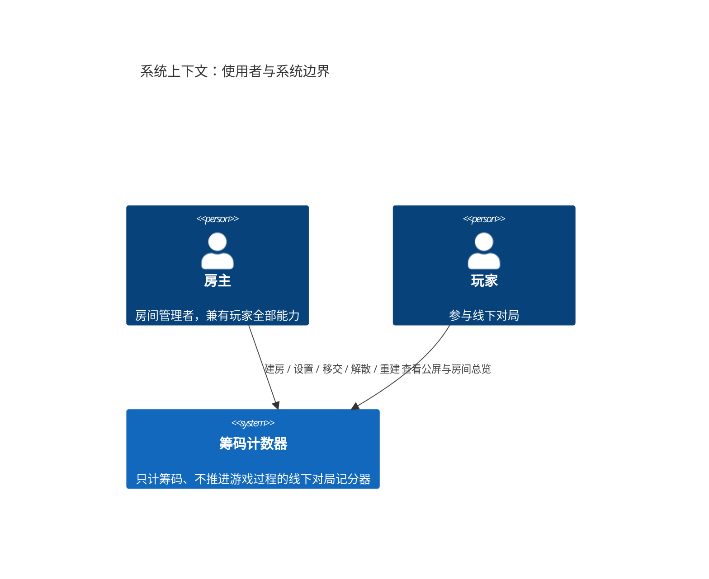
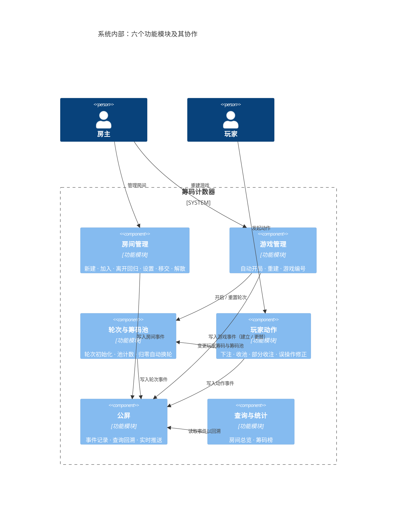
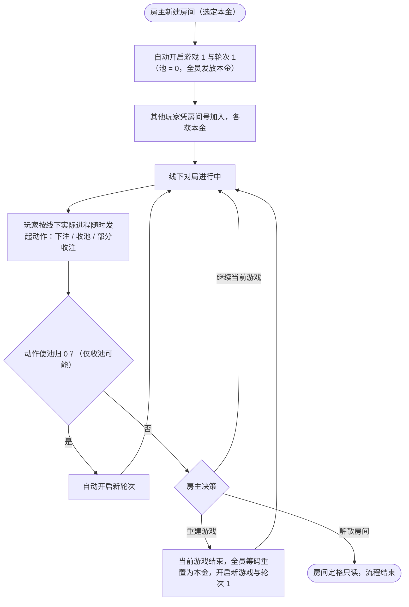
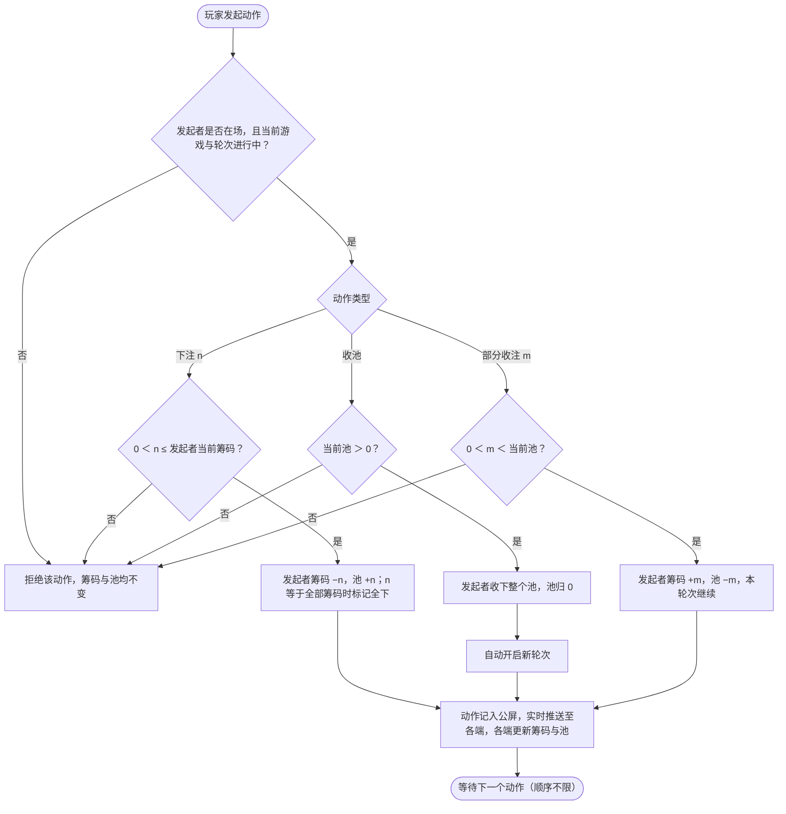
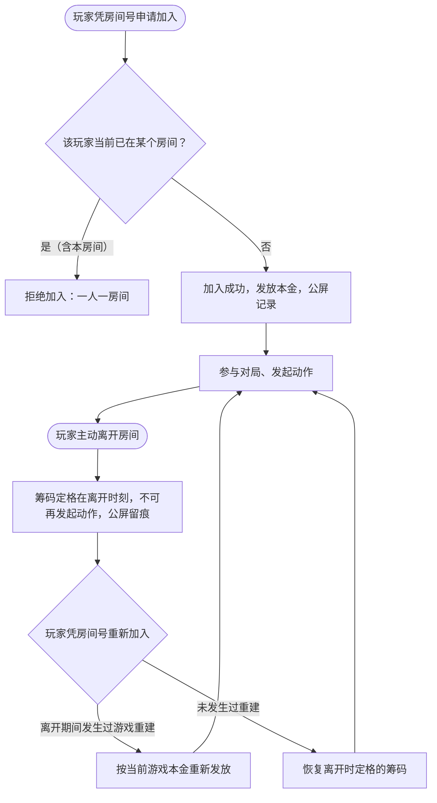
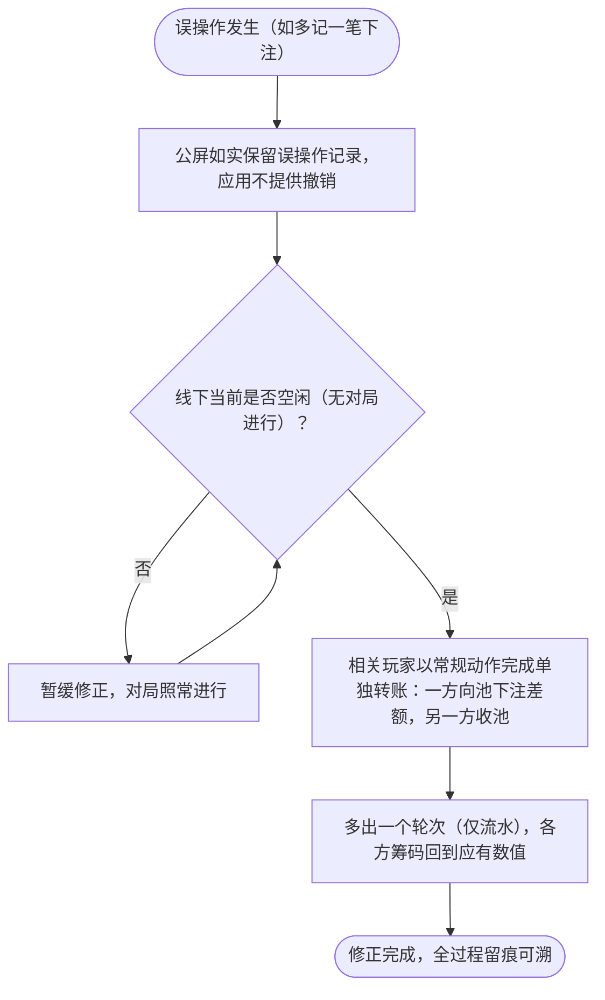

# 筹码计数器（Chips Counter）需求规格书

| 项目 | 内容 |
| --- | --- |
| 文档版本 | v2.11 |
| 发布日期 | 2026-09-18 |
| 文档状态 | 已定稿 —— 待明确事项已全部收敛（后续如有新增需求另行修订） |
| 适用产品 | 筹码计数器（chips-counter） |
| 本版说明 | 模型经多轮需求输入迭代成形（各轮变更详见修订记录）；v2.7 明确动作的双重归属（属于玩家 + 必有轮次归属，INV-8）；v2.8 将 2.2 架构改为 C4 模型绘制；本版补全组件图中游戏管理 → 公屏的事件写入关系（游戏的建立与更替均写入公屏） |

---

## 1. 引言

### 1.1 目的

本文档定义"筹码计数器"应用的产品需求，明确其功能边界、数据规则与非功能要求，作为后续设计、开发、测试与验收的统一依据。本文档**不涉及任何技术实现与接口设计**，实现方式、技术选型由设计文档另行承载。

### 1.2 产品概述

筹码计数器是一款面向**德州扑克及类德州扑克**对局的**多人筹码记分器**。多名玩家汇聚在一个"房间"中，应用实时记录每位玩家的筹码量与每个轮次筹码池的变化，为线下对局提供一致的计数基准。

产品按三层组织：

```
房间（Room）── 承载玩家、房主、房间设置与公屏
 └── 游戏（Game）── 一局完整的筹码再分配周期，玩家筹码以"本金"重置开始
      └── 轮次（Round）── 对应一个筹码池；池归零即自动开启新轮次
           └── 动作（Action）── 下注 / 收池 / 部分收注，由玩家按线下实际进程发起
```

其核心定位声明如下（本声明优先级高于文档中任何其他描述）：

> **本应用只进行筹码的计数，不进行任何游戏过程的推进。**
> **应用中不存在翻前（Pre-flop）、翻牌（Flop）、转牌（Turn）、河牌（River）等任何游戏阶段的概念与状态。游戏过程的推进完全由线下进行。**
> **因此：动作的发起顺序不做任何限制，由线下游戏指定；应用也不校验任何扑克规则层面的动作合法性。**

换言之：牌桌上"轮到谁行动、谁赢了、该分多少"，本应用**一无所知、也不需要知道**；玩家线下得出结论后，把**筹码数量的变化**记录进来即可。

### 1.3 术语与定义

| 术语 | 英文/别名 | 定义 |
| --- | --- | --- |
| 房间 | Room | 玩家聚集与对局进行的容器，持久存在，直至解散 |
| 房间号 | Room Number | 房间对外唯一的加入凭证，知道房间号即可加入房间 |
| 玩家身份 | Player Identity | 全局唯一的玩家标识，用于区分玩家并执行"一人一房间"约束 |
| 房主 | Host | 房间的管理者；建房者自动成为房主，可移交、可解散房间 |
| 玩家 | Player | 加入房间的成员，参与游戏动作；房主同时是玩家 |
| 本金 | 基础筹码量 / Base Chips | 房间设置的基础筹码数值，游戏初始化时每位玩家的起始筹码 |
| 游戏 | Game | 一局完整的筹码再分配周期；房间初始化后自动开启，房主可重建 |
| 轮次 | Round | 游戏内的计数周期，一个轮次对应一个筹码池 |
| 筹码池 | 池 / Pool | 当前轮次中已下注尚未被收走的筹码总和 |
| 动作 | Action | 玩家发起的计数记录：下注、收池、部分收注 |
| 下注 | Bet | 玩家筹码流入筹码池 |
| 全下 | All-in | 下注全部剩余筹码 |
| 收池 | Collect Pot | 玩家收下当前筹码池的全部筹码 |
| 部分收注 | Partial Collect | 玩家从池中收走指定数量筹码，池保留剩余部分继续本轮次 |
| 单独转账 | —— | 误操作的修正方式：线下未进行对局期间，用一次"下注＋收池"在玩家之间转移筹码；会多出一个轮次，但轮次仅是流水 |
| 公屏 | 事件流 / Feed | 房间级的事件记录，展示房间内发生过的一切事件 |
| 重建游戏 | Rebuild | 房主终止当前游戏并开启新游戏，全员筹码重置为本金 |

### 1.4 需求编号规则

- `FR-xxx`：功能需求
- `NFR-xx`：非功能需求
- `INV-xx`：数据不变量（必须始终成立）
- `AC-xx`：验收用例

优先级定义：

| 优先级 | 含义 |
| --- | --- |
| P0 | 第一版（MVP）必须实现，缺一不可 |
| P1 | 第一版应实现，可少量延后，但不影响 P0 闭环 |
| P2 | 增强项，后续版本实现 |

---

## 2. 总体描述

### 2.1 核心边界：做什么、不做什么

| ✅ 本应用做 | ❌ 本应用不做 |
| --- | --- |
| 房间 / 游戏 / 轮次的生命周期管理 | 记录下注轮次、行动顺序；对动作顺序做任何限制或校验 |
| 记录三种动作：下注、收池、部分收注 | 翻前 / 翻牌 / 转牌 / 河牌等任何游戏阶段状态 |
| 实时计数：玩家筹码量、当前筹码池 | 发牌、比牌、牌力评估、胜负判定 |
| 池归零时自动切换轮次 | 计算主池 / 边池及"应得份额"（玩家线下算好，用部分收注录入） |
| 公屏：记录并展示房间内的一切事件 | 盲注 / 级别管理、庄家按钮（Button）轮转、座位管理 |
| 游戏重建：全员筹码重置为本金 | 胜率 / 赔率 / EV 计算、计时器 |
| —— | 在线对局、撮合、聊天（公屏仅为事件记录，非聊天） |
| —— | 专门的撤销 / 红冲机制（误操作以常规动作"单独转账"修正，见 FR-409） |

**顺序不限制原则**：任何在场玩家可在任何时刻发起任何动作（含同一玩家连续多次动作），应用不判断"现在该谁行动"，一切由线下游戏进程决定。

**应得份额不计账原则**：部分收注的金额由玩家线下商定 / 计算后手动录入，应用不推导、不校验其正确性。

### 2.2 功能模块架构

应用由六个功能模块与三项公共支撑构成。架构按 C4 模型分两个视图描述：系统上下文图刻画使用者与系统边界，功能模块组件图刻画系统内部模块及其协作；涉及技术实现的容器 / 部署视图不属于本文件范围（交由设计文档承载）。

**（1）系统上下文图**



**（2）功能模块组件图**



> 公共支撑不以模块形式出现在组件图中，而以约束形式作用于各模块：玩家身份与一人一房间约束（INV-7）、数据规则（INV-1 ~ INV-8）、持久化（NFR-03）。

模块职责与对应需求条目：

| 模块 | 核心职责 | 需求条目 |
| --- | --- | --- |
| 房间管理 | 房间创建、加入、离开与回归、本金设置、房主移交、解散 | FR-101 ~ FR-107 |
| 游戏管理 | 游戏自动开启、重建（重置本金）、游戏编号 | FR-201 ~ FR-204 |
| 轮次与筹码池 | 轮次自动初始化、筹码池计数、池归零自动换轮 | FR-301 ~ FR-304 |
| 玩家动作 | 下注（快捷数值 / 全下 / 手动）、收池、部分收注、误操作修正 | FR-401 ~ FR-409 |
| 公屏 | 房间事件流：记录、查询回溯（唯一历史入口）、实时推送 | FR-501 ~ FR-504 |
| 查询与统计 | 房间总览、玩家筹码榜 | FR-601 ~ FR-602 |
| 公共支撑 | 身份与一人一房间约束、数据规则（守恒 / 序号 / 只增不改）、持久化 | INV-1 ~ INV-7、NFR-03 / 05 / 08 |

### 2.3 用户角色

| 角色 | 权限 |
| --- | --- |
| 房主 | 房间管理（设置、移交、解散）、游戏重建；同时具备玩家的全部权限 |
| 玩家 | 加入 / 离开房间；发起游戏动作（下注、收池、部分收注） |

第一版不引入账号体系；玩家以全局唯一身份区分，"一人一房间"约束强制生效（见 FR-102、NFR-08）。

### 2.4 典型使用场景

1. **开局**：玩家 A 新建房间（自动成为房主，选定本金）→ 房间初始化时自动开启游戏 1 与轮次 1（池为 0）→ 玩家 B、C、D 凭房间号加入房间，各自获得本金筹码。
2. **局中计数**：玩家按线下实际进程随时发起动作——下注（快捷数值 / 全下 / 手动输入）；赢家收池；池归零后系统自动开启新轮次。
3. **边池场景**：短码玩家全下后游戏继续，其余玩家继续下注入池；若短码玩家最终赢下牌局，线下算出其应得的主池份额，用**部分收注**收走该份额，池中剩余部分由边池赢家**收池**（或继续部分收注），直至池归零进入新轮次。
4. **重新开局**：一局游戏打完或打到任意时刻，房主**重建游戏**，全员筹码重置为本金，开启新游戏与其首个轮次。
5. **误操作修正**：记错动作时不撤销——线下未进行对局期间，用一次"下注＋收池"在玩家间**单独转账**补正差额；公屏如实保留误操作与补正全过程，多出的轮次仅是流水，不影响任何游戏过程与状态。
6. **围观与回溯**：任何人随时查看公屏，了解房间内发生过的一切事件；公屏即房间级流水，是唯一的历史回溯入口。
7. **收摊**：房主解散房间，房间定格为只读。

### 2.5 运行环境与交付形态

- 交付形态：可供多名玩家在各自设备上同时使用的应用；客户端形态与实现技术不属于本文件范围。
- 使用环境：牌桌旁实时操作；所有动作必须"一步完成、秒级返回"（NFR-01/02）。
- 部署环境：云端托管——服务端部署于微信云托管（容器化、单实例、按量计费），数据库为云上 MySQL；客户端为微信小程序，微信内即用（v2.11 修订，原"本地 / 局域网、普通个人电脑"约束取消）。

### 2.6 假设与依赖

- 筹码为**纯计数量（点数）**，均为正整数（NFR-06）。
- 本金变更仅对后续新建的游戏生效，当前进行中的游戏不受影响（房主可随时从预设值中调整）。
- 假设线下对局诚实进行，本应用不承担规则仲裁与防作弊职责。

---

## 3. 功能需求

### 3.1 房间管理

| 编号 | 需求 | 优先级 |
| --- | --- | --- |
| FR-101 | 新建房间：任意玩家可创建房间，创建者自动成为房主；创建时从预设值（100 / 200 / 400 / 500 / 800 / 1000）中选择基础筹码量（本金）；房间创建成功即自动初始化一局游戏（见 FR-201） | P0 |
| FR-102 | 加入房间：玩家凭房间号加入——只要知道房间号即可加入，无需邀请或审批；玩家拥有全局唯一身份，同一玩家同一时间至多属于一个房间（一人一房间，强制生效），仍在房间内的重复加入被拒绝；游戏中途加入的玩家立即获得本金筹码并计入当前游戏 | P0 |
| FR-103 | 离开与回归：玩家可主动离开房间，离开后筹码定格在离开时刻、不可再发起动作，公屏留痕；回归凭房间号重新加入即可（游戏推进在线下，应用不设特殊回归流程），恢复定格筹码继续参与；若离开期间房间发生过游戏重建，回归时按当前游戏本金重新发放；加入 / 离开 / 回归均产生公屏事件 | P0 |
| FR-104 | 房间设置：房主唯一可设置项为基础筹码量（本金），且只能从预设值中选择；设置变更产生公屏事件，仅对后续新建的游戏生效 | P0 |
| FR-105 | 房主移交：房主可将房主身份移交给房间内其他玩家，产生公屏事件 | P0 |
| FR-106 | 解散房间：仅房主可解散；解散后房间及其公屏、历史记录转为只读；记录保留期限非永久，由业务侧（代码 / 部署配置）设定，玩家不可配置 | P0 |
| FR-107 | 快捷下注数值：由系统根据本金自动生成、动态调整（按本金比例推导 6 个档位，如本金 1000 → 50 / 100 / 200 / 250 / 500 / 1000，另含全下），不提供任何人为配置入口；具体档位规则在详细设计中细化 | P0 |

### 3.2 游戏管理

| 编号 | 需求 | 优先级 |
| --- | --- | --- |
| FR-201 | 游戏自动初始化：房间初始化后自动开启第一局游戏；同房间同一时刻至多一个进行中的游戏 | P0 |
| FR-202 | 重建游戏：房主可随时重建游戏——当前游戏终止，新游戏开启，**所有玩家筹码重置为房间设置的本金**；产生公屏事件 | P0 |
| FR-203 | 重建保护：重建时若当前筹码池非 0，系统提示二次确认（池中筹码尚未分配完毕，确认后该差额随旧游戏封存）；确认后旧游戏及其当前轮次一并结束 | P1 |
| FR-204 | 游戏编号：每局游戏在房间内单调递增编号（游戏 1、游戏 2 ……） | P0 |

### 3.3 轮次与筹码池

| 编号 | 需求 | 优先级 |
| --- | --- | --- |
| FR-301 | 轮次自动初始化：游戏初始化时自动开启首个轮次（此时池为 0） | P0 |
| FR-302 | 轮次自动切换：**每当筹码池归 0，自动开启一个新的轮次**，无需人工操作；轮次在游戏内单调递增编号 | P0 |
| FR-303 | 筹码池计数：池 = 本轮次全部下注 − 本轮次全部收注，随动作实时更新；轮次开启与归零均产生公屏事件 | P0 |
| FR-304 | 轮次归属：轮次从属于游戏；重建游戏后从新游戏的轮次 1 重新计数 | P0 |

### 3.4 玩家动作

动作为本应用的核心记账单元。三种动作均要求：发起者为房间内在场玩家、当前游戏与轮次处于进行中。

| 编号 | 需求 | 优先级 |
| --- | --- | --- |
| FR-401 | **下注**：玩家筹码减少、筹码池增加同等的正整数数值。金额输入支持三种方式：① 快捷数值选项（系统按本金自动生成，见 FR-107）；② 全下（All-in，即当前全部剩余筹码）；③ 手动输入数值 | P0 |
| FR-402 | 下注校验：0 ＜ 金额 ≤ 玩家当前筹码；金额 = 剩余筹码时视为全下并标记 | P0 |
| FR-403 | **收池**：玩家收下当前筹码池的**全部**筹码；池归 0，触发新轮次（FR-302） | P0 |
| FR-404 | **部分收注**：玩家从池中收走指定数量的筹码，池保留剩余部分，本轮次继续；适用于短码玩家全下后赢下牌局、只能收走应得部分的场景。金额为正整数且 ＜ 当前池（等于整池时应使用收池） | P0 |
| FR-405 | 应得份额不计账：部分收注的金额完全由线下商定 / 计算后录入，应用**不计算、不校验**主池 / 边池份额 | P0 |
| FR-406 | 顺序自由：任何在场玩家可在任何时刻发起任何动作，同一玩家可连续多次动作；应用不做任何顺序与规则校验 | P0 |
| FR-407 | 动作留痕：每个动作记入公屏（含玩家、动作类型、金额、全下标记、所属轮次）；动作完成后各端实时看到该玩家最新筹码与最新筹码池 | P0 |
| FR-408 | 防重复提交：同一动作因网络重试、误触等原因被重复提交时，不产生重复记录 | P1 |
| FR-409 | 误操作修正（单独转账）：应用**不提供**专门的撤销 / 红冲机制。误操作的原始动作与数量如实保留在公屏；修正时由玩家在线下未进行对局期间，用常规的"下注＋收池"动作在相关玩家之间转移差额筹码（单独转账）。修正时机为线下操作约定，应用不感知、不校验；由此多出的轮次仅为流水记录，不参与、不影响任何游戏过程与状态 | P0 |

### 3.5 公屏（房间事件流）

| 编号 | 需求 | 优先级 |
| --- | --- | --- |
| FR-501 | 公屏为房间级、只增不改的事件流，按时间顺序记录房间内发生的一切事件 | P0 |
| FR-502 | 事件类型（首版）：玩家加入、玩家离开、房间设置变更、房主移交、房间解散、游戏开启 / 重建、轮次开启 / 归零、玩家下注（含全下标记）、玩家收池、玩家部分收注 | P0 |
| FR-503 | 公屏查询：支持按时间正序 / 倒序浏览，可按玩家、事件类型筛选；公屏是房间**唯一**的可溯历史记录（房间级流水），游戏更替、轮次更替、全部动作均可由此回溯，不另设独立的游戏历史查询 | P0 |
| FR-504 | 实时推送：公屏事件与房间状态变更实时推送至各端，不采用轮询；历史内容可回看，断线重连后可补拉缺失事件 | P0 |

### 3.6 查询与统计

| 编号 | 需求 | 优先级 |
| --- | --- | --- |
| FR-601 | 房间总览：一次查询返回房间设置、玩家列表及各自当前筹码、当前游戏与轮次、当前筹码池 | P0 |
| FR-602 | 玩家筹码榜：按当前筹码排序展示（用于大屏 / 公屏页） | P1 |

### 3.7 关键业务流程

以下流程图描述各场景下应用的产品行为（校验规则与状态变更），不含实现方式。

**（1）房间与游戏总体流程（生命周期）**



> 玩家的离开与回归可在 LIVE 阶段随时发生，详见流程（3）。

**（2）动作处理流程（三种动作的校验与状态变更）**



> 应用只做上述金额类校验，不判断动作顺序与任何扑克规则（见 2.1 顺序不限制原则）。

**（3）加入、离开与回归流程**



**（4）误操作修正流程（单独转账）**



### 3.8 明确不做（Out of Scope，再次声明）

以下能力**排除**在本产品范围之外：

1. 任何游戏阶段的状态与推进：**翻前、翻牌、转牌、河牌**、下注轮次（Betting Round）。
2. 行动顺序管理、行动计时、超时托管。
3. 底池 / 边池金额计算与"应得份额"计算（玩家线下决定，用部分收注录入）。
4. 盲注 / 前注 / 盲注级别管理、庄家按钮与座位轮转。
5. 发牌、比牌、牌力评估、胜负判定、摊牌记录。
6. 在线对局、房间匹配、聊天（公屏是事件记录，不是聊天）。
7. 胜率、赔率、EV 等计算工具。
8. 真实资金支付与清结算通道，以及筹码与货币的换算、收摊结算报表——筹码为纯计数量，与货币无关（已确认排除）。

---

## 4. 数据要求

### 4.1 概念模型

```
房间
 ├── 房间设置（本金等）
 ├── 玩家（昵称、当前筹码、在场状态）
 │    └── 动作（下注 / 收池 / 部分收注；金额、所属轮次、时间）—— 属于玩家、必有轮次归属、只增不改
 ├── 游戏（序号、状态）        —— 同一时刻至多一个进行中
 │    └── 轮次（序号、筹码池、状态）—— 同一时刻至多一个进行中
 └── 公屏事件（类型、内容、时间）—— 房间级、只增不改
```

实体关键信息：

| 实体 | 关键信息 |
| --- | --- |
| 房间 | 名称、房主、设置、状态（进行中 / 已解散）、创建时间 |
| 玩家 | 所属房间、昵称（房间内唯一）、当前筹码、状态（在场 / 已离开）、加入 / 离开时间 |
| 动作 | 发起玩家（动作归属玩家名下）、所属轮次（必填：动作必须归属发起时当前进行中的轮次）、类型（下注 / 收池 / 部分收注）、金额、是否全下、时间 |
| 游戏 | 所属房间、序号、状态（进行中 / 已结束）、开启 / 结束时间 |
| 轮次 | 所属游戏、序号、状态（进行中 / 已归零关闭）、开启 / 关闭时间 |
| 公屏事件 | 所属房间、类型、内容（谁、做了什么、多少）、时间 |

> 动作归属说明：动作具有双重归属——**属于玩家**（谁发起、记谁的账），同时**必须归属一个轮次**（动作只能发生在当前进行中的轮次，"所属轮次"为必填属性，见 INV-8）。筹码池由与该轮次关联的全部动作汇总推导（见 4.2），公屏中的动作事件亦以玩家为主语记录（见 FR-407）。

### 4.2 计算规则

```
玩家当前筹码 = 本金（游戏开启或中途加入时发放）
             − Σ本游戏有效下注 + Σ本游戏有效收注（收池 + 部分收注）

当前筹码池（某轮次） = Σ该轮次有效下注 − Σ该轮次有效收注
```

- 玩家筹码与筹码池均可由动作流水推导，允许缓存但必须与推导结果一致。
- 所有数值为正整数，全程整数运算。

### 4.3 数据不变量

| 编号 | 不变量 |
| --- | --- |
| INV-1 | 动作金额为正整数；下注 ≤ 发起者当前筹码；部分收注 ＜ 当前池；收池 = 收池时刻的整个池 |
| INV-2 | **游戏内筹码守恒**：同一游戏内任一时刻，Σ该游戏玩家筹码 + 当前筹码池 = 该游戏累计发放总额（游戏开启按在场玩家发放本金，游戏中途加入追加一份本金，回归按 FR-103 规则发放）；游戏经房主确认以非零池终止时，差额随旧游戏封存，不影响新游戏的发放与守恒 |
| INV-3 | 同一房间同一时刻至多一个进行中的游戏；同一游戏同一时刻至多一个进行中的轮次 |
| INV-4 | 轮次与游戏序号各自单调递增，不复用 |
| INV-5 | 动作流水与公屏事件只增不改、不撤销、不删除；误操作一律以追加常规动作（单独转账）的方式修正 |
| INV-6 | 筹码池归 0 当即触发新轮次开启，二者作为一次完整变更同时生效，不出现中间状态 |
| INV-7 | 一名玩家同一时间至多属于一个房间；仍在房间内的玩家重复加入该房间或加入其他房间的请求均被拒绝 |
| INV-8 | 每个动作必须归属一个轮次：即动作发起时刻其所在游戏当前进行中的轮次；不存在无轮次归属的动作 |

---

## 5. 非功能需求

| 编号 | 类别 | 需求 |
| --- | --- | --- |
| NFR-01 | 性能 | 局域网环境下常规操作响应 P95 ＜ 200ms |
| NFR-02 | 操作效率 | 单笔动作（下注 / 收池 / 部分收注）一次操作完成；牌桌旁 10 秒内可完成一次记账 |
| NFR-03 | 持久化 | 房间、游戏、轮次、动作、公屏事件全部持久保存，应用重启零丢失 |
| NFR-04 | 完整性 | 任何动作及其引发的状态变更（含池归零换轮）要么完整生效、要么完全不生效，不出现中间状态 |
| NFR-05 | 并发 | 多玩家多端并发操作不丢账、不串账；重复提交不产生重复记录（FR-408） |
| NFR-06 | 精度 | 全部筹码数值为正整数，应用中不出现小数 |
| NFR-07 | 部署 | 服务端部署于云端托管平台（微信云托管，容器化、单实例锁定、按量计费可缩容到 0），小程序端微信内即用；无需本地服务器、公网域名与备案（v2.11 修订） |
| NFR-08 | 安全 | 面向可信局域网，无账号密码体系；玩家以全局唯一身份区分（身份机制由设计文档确定），一人一房间约束强制生效 |
| NFR-09 | 可追溯 | 房间内一切状态变化均可通过公屏追溯（FR-503） |
| NFR-10 | 时间 | 记录统一保留时间信息；展示按使用者当地时区 |
| NFR-11 | 实时性 | 公屏与状态变更的推送延迟 P95 ＜ 1s |

---

## 6. 验收标准（关键用例）

| 编号 | 场景 | 验收要点 |
| --- | --- | --- |
| AC-01 | 建房即开局 | 玩家 A 新建房间后：A 为房主，房间内自动存在游戏 1 与轮次 1，池为 0，A 筹码 = 本金；公屏记录建房、游戏 1 开启、轮次 1 开启事件 |
| AC-02 | 加入房间 | 玩家 B 凭房间号加入成功，立即持有本金筹码并出现在房间总览，公屏记录加入事件；仍在房间内的 B 重复加入、或 B 加入另一房间均被拒绝；非房主执行设置 / 移交 / 解散 / 重建操作被拒绝 |
| AC-03 | 下注三种输入 | 快捷数值选项随本金自动生成 6 个档位（本金 1000 → 50 / 100 / 200 / 250 / 500 / 1000），且房间设置中无快捷值配置项；全下（金额自动等于剩余筹码并打标记）、手动输入均生效；下注金额 ＞ 当前筹码时操作被拒绝，筹码与池不变 |
| AC-04 | 收池换轮 | 玩家收池后：其筹码增加整池数值，池归 0，轮次序号 +1 自动开启；公屏同时记录收池与新轮次开启事件 |
| AC-05 | 部分收注（边池场景） | 按附录 A 轮次 2：乙全下 300，甲 / 丙 / 丁各下注 800，池 2700；乙部分收注 1200 后池余 1500 且轮次不变；丙收池 1500 后池归 0、自动开启轮次 3 |
| AC-06 | 筹码守恒 | 任一时刻查询房间总览：Σ全员筹码 + 当前池 = 本游戏发放总额（如附录 A 各阶段均为 4000）；重建后新游戏按新发放总额守恒 |
| AC-07 | 重建游戏 | 房主重建后：全员筹码回到本金 1000，新游戏与其轮次 1 开启，原游戏标记结束；公屏记录重建事件 |
| AC-08 | 顺序自由 | 同一玩家连续下注两次、无人下注时直接收池（池为 0 时收池被拒绝）等非常规序列均不被"顺序规则"拒绝，仅受 INV-1 金额约束 |
| AC-09 | 解散与移交 | 房主移交后原房主失去管理权限、新房主可解散；解散后任何动作与管理操作均被拒绝，数据只读可查 |
| AC-10 | 边界回归 | 全文检索产品描述与功能清单，不存在翻前 / 翻牌 / 转牌 / 河牌 / 行动顺序 / 边池计算相关的概念、状态或功能；应用对动作顺序零校验 |
| AC-11 | 误操作修正 | 甲误多记 100 下注后：应用不提供撤销功能，公屏如实保留该误操作；线下空闲时通过"下注＋收池"单独转账补正差额，公屏记录补正动作；补正产生的新轮次不改变任何玩家筹码，守恒校验（AC-06）仍成立 |
| AC-12 | 离开与回归 | 丙离开后：筹码定格 900、其发起动作被拒绝、公屏留痕；丙凭房间号重新加入后恢复 900 筹码并可正常动作；若离开期间发生过游戏重建，回归时按本金重新发放 |
| AC-13 | 实时推送 | 甲发起动作后，其余玩家端 1 秒内收到公屏推送与状态更新，全程无轮询；断线重连后可补拉缺失事件 |

---

## 附录 A：完整示例（数值演算）

**房间配置**：本金 1000；玩家甲、乙、丙、丁（甲为房主）。建房即自动开启游戏 1、轮次 1。

**轮次 1（常规轮）**

| 动作 | 记录 | 池变化 | 池 |
| --- | --- | --- | --- |
| 甲下注 100（快捷数值） | bet 100 | +100 | 100 |
| 乙下注 100 | bet 100 | +100 | 200 |
| 丙下注 100 | bet 100 | +100 | 300 |
| 丁线下弃牌，无动作 | —— | —— | 300 |
| 甲线下赢下，**收池** | collect 300 | −300 | **0 → 自动开启轮次 2** |

轮次 1 结束后筹码：甲 1200、乙 900、丙 900、丁 1000（Σ = 4000 ✅）。

**轮次 2（短码全下 + 部分收注）**

| 动作 | 记录 | 池变化 | 池 |
| --- | --- | --- | --- |
| 乙**全下 300**（All-in，标记） | bet 300 | +300 | 300 |
| 甲下注 800 | bet 800 | +800 | 1100 |
| 丙下注 800 | bet 800 | +800 | 1900 |
| 丁下注 800 | bet 800 | +800 | 2700 |
| 线下继续对局；最终**乙赢主池**（4 × 300 = 1200），**丙赢边池**（1500） | —— | —— | 2700 |
| 乙**部分收注 1200**（应得份额由线下算出） | partial_collect 1200 | −1200 | 1500 |
| 丙**收池** 1500 | collect 1500 | −1500 | **0 → 自动开启轮次 3** |

轮次 2 结束后筹码：甲 400、乙 1800、丙 1600、丁 200（Σ = 4000 ✅ 守恒成立）。

**重建游戏**：房主甲重建 → 游戏 2、轮次 1 开启，甲乙丙丁全部重置为本金 1000，池归 0；公屏记录游戏重建事件。

---

## 附录 B：修订记录

| 版本 | 日期 | 说明 |
| --- | --- | --- |
| v1.0 | 2026-09-17 | 初版：确立"只计数、不推进游戏"的核心边界；牌局 / 银行库存 / 买入兑现结算模型 |
| v2.0 | 2026-09-17 | 依据第二轮需求输入整体重构：以"房间—游戏—轮次—动作"模型取代 v1.0 记账模型（银行库存、买入 / 兑现、面额体系、结算报表等章节随之移除）；新增公屏、三种动作（下注 / 收池 / 部分收注）、池归零自动换轮、重建游戏等需求；新增"待明确事项"章承接后续分批输入 |
| v2.1 | 2026-09-17 | 依据第三轮需求输入：明确误操作修正方式——不做专门撤销 / 红冲机制，误操作通过线下空闲时"下注＋收池"的单独转账补正，额外轮次仅为流水、不影响任何状态；移除撤销接口与待明确事项原第 4 项，其余事项编号顺延 |
| v2.2 | 2026-09-17 | 依据第四轮需求输入收敛全部 9 项待明确事项并移除该章：房间号即加入凭证；一人一房间身份约束（INV-7）；本金从预设值（100/200/400/500/800/1000）中选择且为房间唯一设置项；快捷下注数值由系统按本金自动生成、不可配置；不做货币结算层；公屏与状态变更实时推送（NFR-11）；重建非零池二次确认后差额封存；记录保留期限由代码配置；回归凭房间号恢复定格筹码（重建后按本金发放） |
| v2.3 | 2026-09-17 | 依据第五轮需求输入：移除独立的游戏历史需求（原 FR-205、FR-603）及对应查询接口——公屏即房间级流水，是唯一的历史回溯入口；公屏查询补充按玩家 / 事件类型筛选（FR-503）。FR-205、FR-603 编号从此空缺 |
| v2.10 | 2026-09-18 | 快捷数值档位由 4 档扩充为 6 档，具体生成规则由概要设计定稿（本金 × 5 / 10 / 20 / 25 / 50 / 100%，见概要设计 D6），更新 FR-107 示例与 AC-03；客户端形态（微信小程序、openid 身份）属实现范畴，由概要设计承载，本文档保持技术中立 |
| v2.4 | 2026-09-17 | 依据第六轮要求将文档纯化为产品需求：整体移除接口章（原第 5 章，非功能需求章重新编号为第 5 章）；全文剥离技术实现表述（交付形态、技术选型、幂等键、状态码、原子操作、落盘、乐观锁、错误码等），保留等价的产品级要求；数据要求改为纯概念模型 |
| v2.5 | 2026-09-17 | 新增功能模块架构图（2.2：六模块 + 三公共支撑，含模块—需求条目映射表）与关键业务流程图（3.7：房间与游戏生命周期、动作处理、加入离开回归、误操作修正共 4 幅）；原 2.2~2.5、3.7 节顺延编号 |
| v2.6 | 2026-09-17 | 澄清概念模型中动作的归属：动作由玩家发起、归属玩家名下（原概念图中动作嵌于轮次之下，易误读为从属轮次）；"所属轮次"改为动作的标注属性，筹码池由关联动作汇总推导；实体表将动作调整至玩家之后并补充归属说明 |
| v2.7 | 2026-09-17 | 明确动作的轮次归属为必填约束：动作必须归属发起时当前进行中的轮次，不存在无轮次归属的动作（新增 INV-8）；修订概念图、实体表与归属说明的措辞，确立"属于玩家 + 必有轮次归属"的双重归属语义 |
| v2.8 | 2026-09-17 | 2.2 功能模块架构改用 C4 模型绘制：原 flowchart 架构图替换为系统上下文图（C4Context）与功能模块组件图（C4Component）两视图；公共支撑改为约束说明；模块—需求条目映射表保持不变 |
| v2.9 | 2026-09-17 | 补全功能模块组件图中缺失的"游戏管理 → 公屏"写入关系：游戏的建立（含建房自动开局）与更替（重建）均写入公屏（对应 FR-502 事件类型，图中此前未体现） |
| v2.11 | 2026-09-18 | 部署形态修订：服务端必须部署于云端（微信云托管，容器化、单实例锁定、按量计费），取消 v2.2 确立的"本地 / 局域网、普通个人电脑、无需付费第三方服务"约束（NFR-07 重写、§2.5 部署环境同步）；存储更换为云上 MySQL 5.7.44、登录免 code2Session 等实现层变化由概要 / 详细设计承载 |
